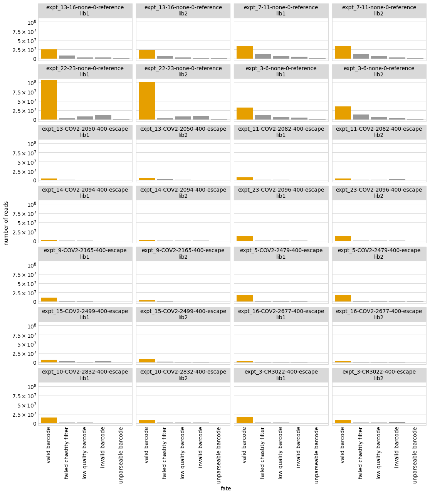

# Count variants in each sample
This Python Jupyter notebook counts occurrences of each barcode in each sample from Illumina barcode sequencing, and adds these counts to the codon variant table.

## Set up analysis
### Import Python modules.
Use [plotnine](https://plotnine.readthedocs.io/en/stable/) for ggplot2-like plotting.

The analysis relies heavily on the Bloom lab's [dms_variants](https://jbloomlab.github.io/dms_variants) package:


```python
import glob
import itertools
import math
import multiprocessing
import multiprocessing.pool
import os
import warnings

import Bio.SeqIO

import dms_variants.codonvarianttable
from dms_variants.constants import CBPALETTE
import dms_variants.illuminabarcodeparser
import dms_variants.utils
import dms_variants.plotnine_themes

from IPython.display import display, HTML

import pandas as pd

from plotnine import *

import yaml
```

Set [plotnine](https://plotnine.readthedocs.io/en/stable/) theme to the gray-grid one defined in `dms_variants`:


```python
theme_set(dms_variants.plotnine_themes.theme_graygrid())
```

Versions of key software:


```python
print(f"Using dms_variants version {dms_variants.__version__}")
```

    Using dms_variants version 0.8.2


Ignore warnings that clutter output:


```python
warnings.simplefilter('ignore')
```

### Parameters for notebook
Read the configuration file:


```python
with open('config.yaml') as f:
    config = yaml.safe_load(f)
```

Make output directory if needed:


```python
os.makedirs(config['counts_dir'], exist_ok=True)
```

## Initialize codon variant table
Initialize the [CodonVariantTable](https://jbloomlab.github.io/dms_variants/dms_variants.codonvarianttable.html#dms_variants.codonvarianttable.CodonVariantTable) using the wildtype gene sequence and the CSV file with the table of variants:


```python
wt_seqrecord = Bio.SeqIO.read(config['wildtype_sequence'], 'fasta')
geneseq = str(wt_seqrecord.seq)
primary_target = wt_seqrecord.name
print(f"Read sequence of {len(geneseq)} nt for {primary_target} from {config['wildtype_sequence']}")
      
print(f"Initializing CodonVariantTable from gene sequence and {config['codon_variant_table']}")
      
variants = dms_variants.codonvarianttable.CodonVariantTable(
                geneseq=geneseq,
                barcode_variant_file=config['codon_variant_table'],
                substitutions_are_codon=True,
                substitutions_col='codon_substitutions',
                primary_target=primary_target)
```

    Read sequence of 603 nt for SARS-CoV-2 from data/wildtype_sequence.fasta
    Initializing CodonVariantTable from gene sequence and results/prior_DMS_data/codon_variant_table.csv


## Setup to parse barcodes
Read data frame with list of all barcode runs.
Note how multiple R1 files are delimited by `; ` and are split out separately:


```python
print(f"Reading list of barcode runs from {config['barcode_runs']}")

barcode_runs = (pd.read_csv(config['barcode_runs'])
                # expand semi-colon separated glob patterns
                .assign(R1=lambda x: x['R1'].str.split('; ').map(
                                lambda y: list(itertools.chain(*map(glob.glob, y))))
                        )
                )
      
display(HTML(barcode_runs.to_html(index=False)))
```

    Reading list of barcode runs from data/barcode_runs.csv


<table border="1" class="dataframe">
  <thead>
    <tr style="text-align: right;">
      <th>library</th>
      <th>sample</th>
      <th>date</th>
      <th>experiment</th>
      <th>antibody</th>
      <th>concentration</th>
      <th>concentration_units</th>
      <th>group</th>
      <th>selection</th>
      <th>frac_escape</th>
      <th>cells_sorted</th>
      <th>R1</th>
    </tr>
  </thead>
  <tbody>
    <tr>
      <td>lib1</td>
      <td>expt_13-16-none-0-reference</td>
      <td>200720</td>
      <td>expt_13-16</td>
      <td>none</td>
      <td>0</td>
      <td>ng_per_mL</td>
      <td>none</td>
      <td>reference</td>
      <td>NaN</td>
      <td>160000000.0</td>
      <td>[/shared/ngs/illumina/agreaney/200727_D00300_1012_AHFFMGBCX3/Unaligned/Project_agreaney/Sample_expt_13-16_lib1_ref/expt_13-16_lib1_ref_AAGGTACA_L001_R1_002.fastq.gz, /shared/ngs/illumina/agreaney/200727_D00300_1012_AHFFMGBCX3/Unaligned/Project_agreaney/Sample_expt_13-16_lib1_ref/expt_13-16_lib1_ref_AAGGTACA_L002_R1_004.fastq.gz, /shared/ngs/illumina/agreaney/200727_D00300_1012_AHFFMGBCX3/Unaligned/Project_agreaney/Sample_expt_13-16_lib1_ref/expt_13-16_lib1_ref_AAGGTACA_L002_R1_002.fastq.gz, /shared/ngs/illumina/agreaney/200727_D00300_1012_AHFFMGBCX3/Unaligned/Project_agreaney/Sample_expt_13-16_lib1_ref/expt_13-16_lib1_ref_AAGGTACA_L001_R1_005.fastq.gz, /shared/ngs/illumina/agreaney/200727_D00300_1012_AHFFMGBCX3/Unaligned/Project_agreaney/Sample_expt_13-16_lib1_ref/expt_13-16_lib1_ref_AAGGTACA_L002_R1_005.fastq.gz, /shared/ngs/illumina/agreaney/200727_D00300_1012_AHFFMGBCX3/Unaligned/Project_agreaney/Sample_expt_13-16_lib1_ref/expt_13-16_lib1_ref_AAGGTACA_L001_R1_004.fastq.gz, /shared/ngs/illumina/agreaney/200727_D00300_1012_AHFFMGBCX3/Unaligned/Project_agreaney/Sample_expt_13-16_lib1_ref/expt_13-16_lib1_ref_AAGGTACA_L002_R1_001.fastq.gz, /shared/ngs/illumina/agreaney/200727_D00300_1012_AHFFMGBCX3/Unaligned/Project_agreaney/Sample_expt_13-16_lib1_ref/expt_13-16_lib1_ref_AAGGTACA_L001_R1_003.fastq.gz, /shared/ngs/illumina/agreaney/200727_D00300_1012_AHFFMGBCX3/Unaligned/Project_agreaney/Sample_expt_13-16_lib1_ref/expt_13-16_lib1_ref_AAGGTACA_L002_R1_003.fastq.gz, /shared/ngs/illumina/agreaney/200727_D00300_1012_AHFFMGBCX3/Unaligned/Project_agreaney/Sample_expt_13-16_lib1_ref/expt_13-16_lib1_ref_AAGGTACA_L001_R1_001.fastq.gz, /shared/ngs/illumina/agreaney/200727_D00300_1012_AHFFMGBCX3/Unaligned/Project_agreaney/Sample_expt_13-16_lib1_ref/expt_13-16_lib1_ref_AAGGTACA_L001_R1_006.fastq.gz, /shared/ngs/illumina/agreaney/200727_D00300_1012_AHFFMGBCX3/Unaligned/Project_agreaney/Sample_expt_13-16_lib1_ref/expt_13-16_lib1_ref_AAGGTACA_L002_R1_006.fastq.gz]</td>
    </tr>
    <tr>
      <td>lib2</td>
      <td>expt_13-16-none-0-reference</td>
      <td>200720</td>
      <td>expt_13-16</td>
      <td>none</td>
      <td>0</td>
      <td>ng_per_mL</td>
      <td>none</td>
      <td>reference</td>
      <td>NaN</td>
      <td>160000000.0</td>
      <td>[/shared/ngs/illumina/agreaney/200727_D00300_1012_AHFFMGBCX3/Unaligned/Project_agreaney/Sample_expt_13-16_lib2_ref/expt_13-16_lib2_ref_ACACAGAA_L001_R1_002.fastq.gz, /shared/ngs/illumina/agreaney/200727_D00300_1012_AHFFMGBCX3/Unaligned/Project_agreaney/Sample_expt_13-16_lib2_ref/expt_13-16_lib2_ref_ACACAGAA_L002_R1_002.fastq.gz, /shared/ngs/illumina/agreaney/200727_D00300_1012_AHFFMGBCX3/Unaligned/Project_agreaney/Sample_expt_13-16_lib2_ref/expt_13-16_lib2_ref_ACACAGAA_L001_R1_004.fastq.gz, /shared/ngs/illumina/agreaney/200727_D00300_1012_AHFFMGBCX3/Unaligned/Project_agreaney/Sample_expt_13-16_lib2_ref/expt_13-16_lib2_ref_ACACAGAA_L001_R1_003.fastq.gz, /shared/ngs/illumina/agreaney/200727_D00300_1012_AHFFMGBCX3/Unaligned/Project_agreaney/Sample_expt_13-16_lib2_ref/expt_13-16_lib2_ref_ACACAGAA_L002_R1_001.fastq.gz, /shared/ngs/illumina/agreaney/200727_D00300_1012_AHFFMGBCX3/Unaligned/Project_agreaney/Sample_expt_13-16_lib2_ref/expt_13-16_lib2_ref_ACACAGAA_L002_R1_005.fastq.gz, /shared/ngs/illumina/agreaney/200727_D00300_1012_AHFFMGBCX3/Unaligned/Project_agreaney/Sample_expt_13-16_lib2_ref/expt_13-16_lib2_ref_ACACAGAA_L002_R1_004.fastq.gz, /shared/ngs/illumina/agreaney/200727_D00300_1012_AHFFMGBCX3/Unaligned/Project_agreaney/Sample_expt_13-16_lib2_ref/expt_13-16_lib2_ref_ACACAGAA_L002_R1_003.fastq.gz, /shared/ngs/illumina/agreaney/200727_D00300_1012_AHFFMGBCX3/Unaligned/Project_agreaney/Sample_expt_13-16_lib2_ref/expt_13-16_lib2_ref_ACACAGAA_L001_R1_005.fastq.gz, /shared/ngs/illumina/agreaney/200727_D00300_1012_AHFFMGBCX3/Unaligned/Project_agreaney/Sample_expt_13-16_lib2_ref/expt_13-16_lib2_ref_ACACAGAA_L001_R1_001.fastq.gz]</td>
    </tr>
    <tr>
      <td>lib1</td>
      <td>expt_7-11-none-0-reference</td>
      <td>200616</td>
      <td>expt_7-11</td>
      <td>none</td>
      <td>0</td>
      <td>ng_per_mL</td>
      <td>none</td>
      <td>reference</td>
      <td>NaN</td>
      <td>160000000.0</td>
      <td>[/shared/ngs/illumina/agreaney/200618_D00300_0980_AHFCMJBCX3/Unaligned/Project_agreaney/Sample_expt_7-11_lib1_ACE2pos/expt_7-11_lib1_ACE2pos_AGCAGGAA_L002_R1_005.fastq.gz, /shared/ngs/illumina/agreaney/200618_D00300_0980_AHFCMJBCX3/Unaligned/Project_agreaney/Sample_expt_7-11_lib1_ACE2pos/expt_7-11_lib1_ACE2pos_AGCAGGAA_L001_R1_004.fastq.gz, /shared/ngs/illumina/agreaney/200618_D00300_0980_AHFCMJBCX3/Unaligned/Project_agreaney/Sample_expt_7-11_lib1_ACE2pos/expt_7-11_lib1_ACE2pos_AGCAGGAA_L002_R1_002.fastq.gz, /shared/ngs/illumina/agreaney/200618_D00300_0980_AHFCMJBCX3/Unaligned/Project_agreaney/Sample_expt_7-11_lib1_ACE2pos/expt_7-11_lib1_ACE2pos_AGCAGGAA_L002_R1_001.fastq.gz, /shared/ngs/illumina/agreaney/200618_D00300_0980_AHFCMJBCX3/Unaligned/Project_agreaney/Sample_expt_7-11_lib1_ACE2pos/expt_7-11_lib1_ACE2pos_AGCAGGAA_L001_R1_008.fastq.gz, /shared/ngs/illumina/agreaney/200618_D00300_0980_AHFCMJBCX3/Unaligned/Project_agreaney/Sample_expt_7-11_lib1_ACE2pos/expt_7-11_lib1_ACE2pos_AGCAGGAA_L001_R1_003.fastq.gz, /shared/ngs/illumina/agreaney/200618_D00300_0980_AHFCMJBCX3/Unaligned/Project_agreaney/Sample_expt_7-11_lib1_ACE2pos/expt_7-11_lib1_ACE2pos_AGCAGGAA_L001_R1_006.fastq.gz, /shared/ngs/illumina/agreaney/200618_D00300_0980_AHFCMJBCX3/Unaligned/Project_agreaney/Sample_expt_7-11_lib1_ACE2pos/expt_7-11_lib1_ACE2pos_AGCAGGAA_L001_R1_001.fastq.gz, /shared/ngs/illumina/agreaney/200618_D00300_0980_AHFCMJBCX3/Unaligned/Project_agreaney/Sample_expt_7-11_lib1_ACE2pos/expt_7-11_lib1_ACE2pos_AGCAGGAA_L002_R1_008.fastq.gz, /shared/ngs/illumina/agreaney/200618_D00300_0980_AHFCMJBCX3/Unaligned/Project_agreaney/Sample_expt_7-11_lib1_ACE2pos/expt_7-11_lib1_ACE2pos_AGCAGGAA_L002_R1_003.fastq.gz, /shared/ngs/illumina/agreaney/200618_D00300_0980_AHFCMJBCX3/Unaligned/Project_agreaney/Sample_expt_7-11_lib1_ACE2pos/expt_7-11_lib1_ACE2pos_AGCAGGAA_L002_R1_006.fastq.gz, /shared/ngs/illumina/agreaney/200618_D00300_0980_AHFCMJBCX3/Unaligned/Project_agreaney/Sample_expt_7-11_lib1_ACE2pos/expt_7-11_lib1_ACE2pos_AGCAGGAA_L001_R1_002.fastq.gz, /shared/ngs/illumina/agreaney/200618_D00300_0980_AHFCMJBCX3/Unaligned/Project_agreaney/Sample_expt_7-11_lib1_ACE2pos/expt_7-11_lib1_ACE2pos_AGCAGGAA_L002_R1_004.fastq.gz, /shared/ngs/illumina/agreaney/200618_D00300_0980_AHFCMJBCX3/Unaligned/Project_agreaney/Sample_expt_7-11_lib1_ACE2pos/expt_7-11_lib1_ACE2pos_AGCAGGAA_L001_R1_007.fastq.gz, /shared/ngs/illumina/agreaney/200618_D00300_0980_AHFCMJBCX3/Unaligned/Project_agreaney/Sample_expt_7-11_lib1_ACE2pos/expt_7-11_lib1_ACE2pos_AGCAGGAA_L002_R1_007.fastq.gz, /shared/ngs/illumina/agreaney/200618_D00300_0980_AHFCMJBCX3/Unaligned/Project_agreaney/Sample_expt_7-11_lib1_ACE2pos/expt_7-11_lib1_ACE2pos_AGCAGGAA_L001_R1_005.fastq.gz]</td>
    </tr>
    <tr>
      <td>lib2</td>
      <td>expt_7-11-none-0-reference</td>
      <td>200616</td>
      <td>expt_7-11</td>
      <td>none</td>
      <td>0</td>
      <td>ng_per_mL</td>
      <td>none</td>
      <td>reference</td>
      <td>NaN</td>
      <td>160000000.0</td>
      <td>[/shared/ngs/illumina/agreaney/200618_D00300_0980_AHFCMJBCX3/Unaligned/Project_agreaney/Sample_expt_7-11_lib2_ACE2pos/expt_7-11_lib2_ACE2pos_AGTCACTA_L002_R1_004.fastq.gz, /shared/ngs/illumina/agreaney/200618_D00300_0980_AHFCMJBCX3/Unaligned/Project_agreaney/Sample_expt_7-11_lib2_ACE2pos/expt_7-11_lib2_ACE2pos_AGTCACTA_L002_R1_002.fastq.gz, /shared/ngs/illumina/agreaney/200618_D00300_0980_AHFCMJBCX3/Unaligned/Project_agreaney/Sample_expt_7-11_lib2_ACE2pos/expt_7-11_lib2_ACE2pos_AGTCACTA_L002_R1_003.fastq.gz, /shared/ngs/illumina/agreaney/200618_D00300_0980_AHFCMJBCX3/Unaligned/Project_agreaney/Sample_expt_7-11_lib2_ACE2pos/expt_7-11_lib2_ACE2pos_AGTCACTA_L001_R1_006.fastq.gz, /shared/ngs/illumina/agreaney/200618_D00300_0980_AHFCMJBCX3/Unaligned/Project_agreaney/Sample_expt_7-11_lib2_ACE2pos/expt_7-11_lib2_ACE2pos_AGTCACTA_L001_R1_008.fastq.gz, /shared/ngs/illumina/agreaney/200618_D00300_0980_AHFCMJBCX3/Unaligned/Project_agreaney/Sample_expt_7-11_lib2_ACE2pos/expt_7-11_lib2_ACE2pos_AGTCACTA_L001_R1_007.fastq.gz, /shared/ngs/illumina/agreaney/200618_D00300_0980_AHFCMJBCX3/Unaligned/Project_agreaney/Sample_expt_7-11_lib2_ACE2pos/expt_7-11_lib2_ACE2pos_AGTCACTA_L001_R1_003.fastq.gz, /shared/ngs/illumina/agreaney/200618_D00300_0980_AHFCMJBCX3/Unaligned/Project_agreaney/Sample_expt_7-11_lib2_ACE2pos/expt_7-11_lib2_ACE2pos_AGTCACTA_L002_R1_008.fastq.gz, /shared/ngs/illumina/agreaney/200618_D00300_0980_AHFCMJBCX3/Unaligned/Project_agreaney/Sample_expt_7-11_lib2_ACE2pos/expt_7-11_lib2_ACE2pos_AGTCACTA_L001_R1_004.fastq.gz, /shared/ngs/illumina/agreaney/200618_D00300_0980_AHFCMJBCX3/Unaligned/Project_agreaney/Sample_expt_7-11_lib2_ACE2pos/expt_7-11_lib2_ACE2pos_AGTCACTA_L001_R1_005.fastq.gz, /shared/ngs/illumina/agreaney/200618_D00300_0980_AHFCMJBCX3/Unaligned/Project_agreaney/Sample_expt_7-11_lib2_ACE2pos/expt_7-11_lib2_ACE2pos_AGTCACTA_L002_R1_001.fastq.gz, /shared/ngs/illumina/agreaney/200618_D00300_0980_AHFCMJBCX3/Unaligned/Project_agreaney/Sample_expt_7-11_lib2_ACE2pos/expt_7-11_lib2_ACE2pos_AGTCACTA_L002_R1_005.fastq.gz, /shared/ngs/illumina/agreaney/200618_D00300_0980_AHFCMJBCX3/Unaligned/Project_agreaney/Sample_expt_7-11_lib2_ACE2pos/expt_7-11_lib2_ACE2pos_AGTCACTA_L002_R1_006.fastq.gz, /shared/ngs/illumina/agreaney/200618_D00300_0980_AHFCMJBCX3/Unaligned/Project_agreaney/Sample_expt_7-11_lib2_ACE2pos/expt_7-11_lib2_ACE2pos_AGTCACTA_L002_R1_007.fastq.gz, /shared/ngs/illumina/agreaney/200618_D00300_0980_AHFCMJBCX3/Unaligned/Project_agreaney/Sample_expt_7-11_lib2_ACE2pos/expt_7-11_lib2_ACE2pos_AGTCACTA_L001_R1_001.fastq.gz, /shared/ngs/illumina/agreaney/200618_D00300_0980_AHFCMJBCX3/Unaligned/Project_agreaney/Sample_expt_7-11_lib2_ACE2pos/expt_7-11_lib2_ACE2pos_AGTCACTA_L001_R1_002.fastq.gz]</td>
    </tr>
    <tr>
      <td>lib1</td>
      <td>expt_22-23-none-0-reference</td>
      <td>200810</td>
      <td>expt_22-23</td>
      <td>none</td>
      <td>0</td>
      <td>ng_per_mL</td>
      <td>none</td>
      <td>reference</td>
      <td>NaN</td>
      <td>160000000.0</td>
      <td>[/shared/ngs/illumina/agreaney/200812_D00300_1026_BHFFJTBCX3/Unaligned/Project_agreaney/Sample_expt_22-23_lib1_ref/expt_22-23_lib1_ref_ACCACTGT_L001_R1_017.fastq.gz, /shared/ngs/illumina/agreaney/200812_D00300_1026_BHFFJTBCX3/Unaligned/Project_agreaney/Sample_expt_22-23_lib1_ref/expt_22-23_lib1_ref_ACCACTGT_L002_R1_007.fastq.gz, /shared/ngs/illumina/agreaney/200812_D00300_1026_BHFFJTBCX3/Unaligned/Project_agreaney/Sample_expt_22-23_lib1_ref/expt_22-23_lib1_ref_ACCACTGT_L002_R1_003.fastq.gz, /shared/ngs/illumina/agreaney/200812_D00300_1026_BHFFJTBCX3/Unaligned/Project_agreaney/Sample_expt_22-23_lib1_ref/expt_22-23_lib1_ref_ACCACTGT_L001_R1_010.fastq.gz, /shared/ngs/illumina/agreaney/200812_D00300_1026_BHFFJTBCX3/Unaligned/Project_agreaney/Sample_expt_22-23_lib1_ref/expt_22-23_lib1_ref_ACCACTGT_L001_R1_005.fastq.gz, /shared/ngs/illumina/agreaney/200812_D00300_1026_BHFFJTBCX3/Unaligned/Project_agreaney/Sample_expt_22-23_lib1_ref/expt_22-23_lib1_ref_ACCACTGT_L002_R1_012.fastq.gz, /shared/ngs/illumina/agreaney/200812_D00300_1026_BHFFJTBCX3/Unaligned/Project_agreaney/Sample_expt_22-23_lib1_ref/expt_22-23_lib1_ref_ACCACTGT_L002_R1_006.fastq.gz, /shared/ngs/illumina/agreaney/200812_D00300_1026_BHFFJTBCX3/Unaligned/Project_agreaney/Sample_expt_22-23_lib1_ref/expt_22-23_lib1_ref_ACCACTGT_L001_R1_009.fastq.gz, /shared/ngs/illumina/agreaney/200812_D00300_1026_BHFFJTBCX3/Unaligned/Project_agreaney/Sample_expt_22-23_lib1_ref/expt_22-23_lib1_ref_ACCACTGT_L001_R1_013.fastq.gz, /shared/ngs/illumina/agreaney/200812_D00300_1026_BHFFJTBCX3/Unaligned/Project_agreaney/Sample_expt_22-23_lib1_ref/expt_22-23_lib1_ref_ACCACTGT_L002_R1_008.fastq.gz, /shared/ngs/illumina/agreaney/200812_D00300_1026_BHFFJTBCX3/Unaligned/Project_agreaney/Sample_expt_22-23_lib1_ref/expt_22-23_lib1_ref_ACCACTGT_L001_R1_006.fastq.gz, /shared/ngs/illumina/agreaney/200812_D00300_1026_BHFFJTBCX3/Unaligned/Project_agreaney/Sample_expt_22-23_lib1_ref/expt_22-23_lib1_ref_ACCACTGT_L001_R1_003.fastq.gz, /shared/ngs/illumina/agreaney/200812_D00300_1026_BHFFJTBCX3/Unaligned/Project_agreaney/Sample_expt_22-23_lib1_ref/expt_22-23_lib1_ref_ACCACTGT_L001_R1_016.fastq.gz, /shared/ngs/illumina/agreaney/200812_D00300_1026_BHFFJTBCX3/Unaligned/Project_agreaney/Sample_expt_22-23_lib1_ref/expt_22-23_lib1_ref_ACCACTGT_L002_R1_005.fastq.gz, /shared/ngs/illumina/agreaney/200812_D00300_1026_BHFFJTBCX3/Unaligned/Project_agreaney/Sample_expt_22-23_lib1_ref/expt_22-23_lib1_ref_ACCACTGT_L001_R1_012.fastq.gz, /shared/ngs/illumina/agreaney/200812_D00300_1026_BHFFJTBCX3/Unaligned/Project_agreaney/Sample_expt_22-23_lib1_ref/expt_22-23_lib1_ref_ACCACTGT_L001_R1_011.fastq.gz, /shared/ngs/illumina/agreaney/200812_D00300_1026_BHFFJTBCX3/Unaligned/Project_agreaney/Sample_expt_22-23_lib1_ref/expt_22-23_lib1_ref_ACCACTGT_L002_R1_004.fastq.gz, /shared/ngs/illumina/agreaney/200812_D00300_1026_BHFFJTBCX3/Unaligned/Project_agreaney/Sample_expt_22-23_lib1_ref/expt_22-23_lib1_ref_ACCACTGT_L002_R1_016.fastq.gz, /shared/ngs/illumina/agreaney/200812_D00300_1026_BHFFJTBCX3/Unaligned/Project_agreaney/Sample_expt_22-23_lib1_ref/expt_22-23_lib1_ref_ACCACTGT_L002_R1_014.fastq.gz, /shared/ngs/illumina/agreaney/200812_D00300_1026_BHFFJTBCX3/Unaligned/Project_agreaney/Sample_expt_22-23_lib1_ref/expt_22-23_lib1_ref_ACCACTGT_L001_R1_015.fastq.gz, /shared/ngs/illumina/agreaney/200812_D00300_1026_BHFFJTBCX3/Unaligned/Project_agreaney/Sample_expt_22-23_lib1_ref/expt_22-23_lib1_ref_ACCACTGT_L001_R1_008.fastq.gz, /shared/ngs/illumina/agreaney/200812_D00300_1026_BHFFJTBCX3/Unaligned/Project_agreaney/Sample_expt_22-23_lib1_ref/expt_22-23_lib1_ref_ACCACTGT_L001_R1_007.fastq.gz, /shared/ngs/illumina/agreaney/200812_D00300_1026_BHFFJTBCX3/Unaligned/Project_agreaney/Sample_expt_22-23_lib1_ref/expt_22-23_lib1_ref_ACCACTGT_L002_R1_010.fastq.gz, /shared/ngs/illumina/agreaney/200812_D00300_1026_BHFFJTBCX3/Unaligned/Project_agreaney/Sample_expt_22-23_lib1_ref/expt_22-23_lib1_ref_ACCACTGT_L001_R1_002.fastq.gz, /shared/ngs/illumina/agreaney/200812_D00300_1026_BHFFJTBCX3/Unaligned/Project_agreaney/Sample_expt_22-23_lib1_ref/expt_22-23_lib1_ref_ACCACTGT_L001_R1_014.fastq.gz, /shared/ngs/illumina/agreaney/200812_D00300_1026_BHFFJTBCX3/Unaligned/Project_agreaney/Sample_expt_22-23_lib1_ref/expt_22-23_lib1_ref_ACCACTGT_L002_R1_009.fastq.gz, /shared/ngs/illumina/agreaney/200812_D00300_1026_BHFFJTBCX3/Unaligned/Project_agreaney/Sample_expt_22-23_lib1_ref/expt_22-23_lib1_ref_ACCACTGT_L001_R1_001.fastq.gz, /shared/ngs/illumina/agreaney/200812_D00300_1026_BHFFJTBCX3/Unaligned/Project_agreaney/Sample_expt_22-23_lib1_ref/expt_22-23_lib1_ref_ACCACTGT_L002_R1_001.fastq.gz, /shared/ngs/illumina/agreaney/200812_D00300_1026_BHFFJTBCX3/Unaligned/Project_agreaney/Sample_expt_22-23_lib1_ref/expt_22-23_lib1_ref_ACCACTGT_L002_R1_011.fastq.gz, /shared/ngs/illumina/agreaney/200812_D00300_1026_BHFFJTBCX3/Unaligned/Project_agreaney/Sample_expt_22-23_lib1_ref/expt_22-23_lib1_ref_ACCACTGT_L001_R1_004.fastq.gz, /shared/ngs/illumina/agreaney/200812_D00300_1026_BHFFJTBCX3/Unaligned/Project_agreaney/Sample_expt_22-23_lib1_ref/expt_22-23_lib1_ref_ACCACTGT_L002_R1_013.fastq.gz, /shared/ngs/illumina/agreaney/200812_D00300_1026_BHFFJTBCX3/Unaligned/Project_agreaney/Sample_expt_22-23_lib1_ref/expt_22-23_lib1_ref_ACCACTGT_L002_R1_017.fastq.gz, /shared/ngs/illumina/agreaney/200812_D00300_1026_BHFFJTBCX3/Unaligned/Project_agreaney/Sample_expt_22-23_lib1_ref/expt_22-23_lib1_ref_ACCACTGT_L002_R1_002.fastq.gz, /shared/ngs/illumina/agreaney/200812_D00300_1026_BHFFJTBCX3/Unaligned/Project_agreaney/Sample_expt_22-23_lib1_ref/expt_22-23_lib1_ref_ACCACTGT_L002_R1_015.fastq.gz]</td>
    </tr>
    <tr>
      <td>lib2</td>
      <td>expt_22-23-none-0-reference</td>
      <td>200810</td>
      <td>expt_22-23</td>
      <td>none</td>
      <td>0</td>
      <td>ng_per_mL</td>
      <td>none</td>
      <td>reference</td>
      <td>NaN</td>
      <td>160000000.0</td>
      <td>[/shared/ngs/illumina/agreaney/200812_D00300_1026_BHFFJTBCX3/Unaligned/Project_agreaney/Sample_expt_22-23_lib2_ref/expt_22-23_lib2_ref_ACATTGGC_L002_R1_006.fastq.gz, /shared/ngs/illumina/agreaney/200812_D00300_1026_BHFFJTBCX3/Unaligned/Project_agreaney/Sample_expt_22-23_lib2_ref/expt_22-23_lib2_ref_ACATTGGC_L001_R1_014.fastq.gz, /shared/ngs/illumina/agreaney/200812_D00300_1026_BHFFJTBCX3/Unaligned/Project_agreaney/Sample_expt_22-23_lib2_ref/expt_22-23_lib2_ref_ACATTGGC_L001_R1_003.fastq.gz, /shared/ngs/illumina/agreaney/200812_D00300_1026_BHFFJTBCX3/Unaligned/Project_agreaney/Sample_expt_22-23_lib2_ref/expt_22-23_lib2_ref_ACATTGGC_L001_R1_006.fastq.gz, /shared/ngs/illumina/agreaney/200812_D00300_1026_BHFFJTBCX3/Unaligned/Project_agreaney/Sample_expt_22-23_lib2_ref/expt_22-23_lib2_ref_ACATTGGC_L002_R1_008.fastq.gz, /shared/ngs/illumina/agreaney/200812_D00300_1026_BHFFJTBCX3/Unaligned/Project_agreaney/Sample_expt_22-23_lib2_ref/expt_22-23_lib2_ref_ACATTGGC_L002_R1_004.fastq.gz, /shared/ngs/illumina/agreaney/200812_D00300_1026_BHFFJTBCX3/Unaligned/Project_agreaney/Sample_expt_22-23_lib2_ref/expt_22-23_lib2_ref_ACATTGGC_L002_R1_001.fastq.gz, /shared/ngs/illumina/agreaney/200812_D00300_1026_BHFFJTBCX3/Unaligned/Project_agreaney/Sample_expt_22-23_lib2_ref/expt_22-23_lib2_ref_ACATTGGC_L001_R1_007.fastq.gz, /shared/ngs/illumina/agreaney/200812_D00300_1026_BHFFJTBCX3/Unaligned/Project_agreaney/Sample_expt_22-23_lib2_ref/expt_22-23_lib2_ref_ACATTGGC_L001_R1_002.fastq.gz, /shared/ngs/illumina/agreaney/200812_D00300_1026_BHFFJTBCX3/Unaligned/Project_agreaney/Sample_expt_22-23_lib2_ref/expt_22-23_lib2_ref_ACATTGGC_L001_R1_016.fastq.gz, /shared/ngs/illumina/agreaney/200812_D00300_1026_BHFFJTBCX3/Unaligned/Project_agreaney/Sample_expt_22-23_lib2_ref/expt_22-23_lib2_ref_ACATTGGC_L001_R1_013.fastq.gz, /shared/ngs/illumina/agreaney/200812_D00300_1026_BHFFJTBCX3/Unaligned/Project_agreaney/Sample_expt_22-23_lib2_ref/expt_22-23_lib2_ref_ACATTGGC_L002_R1_010.fastq.gz, /shared/ngs/illumina/agreaney/200812_D00300_1026_BHFFJTBCX3/Unaligned/Project_agreaney/Sample_expt_22-23_lib2_ref/expt_22-23_lib2_ref_ACATTGGC_L002_R1_007.fastq.gz, /shared/ngs/illumina/agreaney/200812_D00300_1026_BHFFJTBCX3/Unaligned/Project_agreaney/Sample_expt_22-23_lib2_ref/expt_22-23_lib2_ref_ACATTGGC_L001_R1_009.fastq.gz, /shared/ngs/illumina/agreaney/200812_D00300_1026_BHFFJTBCX3/Unaligned/Project_agreaney/Sample_expt_22-23_lib2_ref/expt_22-23_lib2_ref_ACATTGGC_L002_R1_016.fastq.gz, /shared/ngs/illumina/agreaney/200812_D00300_1026_BHFFJTBCX3/Unaligned/Project_agreaney/Sample_expt_22-23_lib2_ref/expt_22-23_lib2_ref_ACATTGGC_L002_R1_003.fastq.gz, /shared/ngs/illumina/agreaney/200812_D00300_1026_BHFFJTBCX3/Unaligned/Project_agreaney/Sample_expt_22-23_lib2_ref/expt_22-23_lib2_ref_ACATTGGC_L001_R1_015.fastq.gz, /shared/ngs/illumina/agreaney/200812_D00300_1026_BHFFJTBCX3/Unaligned/Project_agreaney/Sample_expt_22-23_lib2_ref/expt_22-23_lib2_ref_ACATTGGC_L001_R1_010.fastq.gz, /shared/ngs/illumina/agreaney/200812_D00300_1026_BHFFJTBCX3/Unaligned/Project_agreaney/Sample_expt_22-23_lib2_ref/expt_22-23_lib2_ref_ACATTGGC_L001_R1_008.fastq.gz, /shared/ngs/illumina/agreaney/200812_D00300_1026_BHFFJTBCX3/Unaligned/Project_agreaney/Sample_expt_22-23_lib2_ref/expt_22-23_lib2_ref_ACATTGGC_L001_R1_001.fastq.gz, /shared/ngs/illumina/agreaney/200812_D00300_1026_BHFFJTBCX3/Unaligned/Project_agreaney/Sample_expt_22-23_lib2_ref/expt_22-23_lib2_ref_ACATTGGC_L002_R1_011.fastq.gz, /shared/ngs/illumina/agreaney/200812_D00300_1026_BHFFJTBCX3/Unaligned/Project_agreaney/Sample_expt_22-23_lib2_ref/expt_22-23_lib2_ref_ACATTGGC_L001_R1_011.fastq.gz, /shared/ngs/illumina/agreaney/200812_D00300_1026_BHFFJTBCX3/Unaligned/Project_agreaney/Sample_expt_22-23_lib2_ref/expt_22-23_lib2_ref_ACATTGGC_L002_R1_013.fastq.gz, /shared/ngs/illumina/agreaney/200812_D00300_1026_BHFFJTBCX3/Unaligned/Project_agreaney/Sample_expt_22-23_lib2_ref/expt_22-23_lib2_ref_ACATTGGC_L002_R1_002.fastq.gz, /shared/ngs/illumina/agreaney/200812_D00300_1026_BHFFJTBCX3/Unaligned/Project_agreaney/Sample_expt_22-23_lib2_ref/expt_22-23_lib2_ref_ACATTGGC_L002_R1_014.fastq.gz, /shared/ngs/illumina/agreaney/200812_D00300_1026_BHFFJTBCX3/Unaligned/Project_agreaney/Sample_expt_22-23_lib2_ref/expt_22-23_lib2_ref_ACATTGGC_L001_R1_005.fastq.gz, /shared/ngs/illumina/agreaney/200812_D00300_1026_BHFFJTBCX3/Unaligned/Project_agreaney/Sample_expt_22-23_lib2_ref/expt_22-23_lib2_ref_ACATTGGC_L001_R1_004.fastq.gz, /shared/ngs/illumina/agreaney/200812_D00300_1026_BHFFJTBCX3/Unaligned/Project_agreaney/Sample_expt_22-23_lib2_ref/expt_22-23_lib2_ref_ACATTGGC_L002_R1_012.fastq.gz, /shared/ngs/illumina/agreaney/200812_D00300_1026_BHFFJTBCX3/Unaligned/Project_agreaney/Sample_expt_22-23_lib2_ref/expt_22-23_lib2_ref_ACATTGGC_L002_R1_005.fastq.gz, /shared/ngs/illumina/agreaney/200812_D00300_1026_BHFFJTBCX3/Unaligned/Project_agreaney/Sample_expt_22-23_lib2_ref/expt_22-23_lib2_ref_ACATTGGC_L002_R1_009.fastq.gz, /shared/ngs/illumina/agreaney/200812_D00300_1026_BHFFJTBCX3/Unaligned/Project_agreaney/Sample_expt_22-23_lib2_ref/expt_22-23_lib2_ref_ACATTGGC_L002_R1_015.fastq.gz, /shared/ngs/illumina/agreaney/200812_D00300_1026_BHFFJTBCX3/Unaligned/Project_agreaney/Sample_expt_22-23_lib2_ref/expt_22-23_lib2_ref_ACATTGGC_L001_R1_012.fastq.gz]</td>
    </tr>
    <tr>
      <td>lib1</td>
      <td>expt_3-6-none-0-reference</td>
      <td>200615</td>
      <td>expt_3-6</td>
      <td>none</td>
      <td>0</td>
      <td>ng_per_mL</td>
      <td>none</td>
      <td>reference</td>
      <td>NaN</td>
      <td>160000000.0</td>
      <td>[/shared/ngs/illumina/agreaney/200618_D00300_0980_AHFCMJBCX3/Unaligned/Project_agreaney/Sample_expt_3-6_lib1_ACE2pos/expt_3-6_lib1_ACE2pos_AGAGTCAA_L001_R1_004.fastq.gz, /shared/ngs/illumina/agreaney/200618_D00300_0980_AHFCMJBCX3/Unaligned/Project_agreaney/Sample_expt_3-6_lib1_ACE2pos/expt_3-6_lib1_ACE2pos_AGAGTCAA_L001_R1_008.fastq.gz, /shared/ngs/illumina/agreaney/200618_D00300_0980_AHFCMJBCX3/Unaligned/Project_agreaney/Sample_expt_3-6_lib1_ACE2pos/expt_3-6_lib1_ACE2pos_AGAGTCAA_L002_R1_004.fastq.gz, /shared/ngs/illumina/agreaney/200618_D00300_0980_AHFCMJBCX3/Unaligned/Project_agreaney/Sample_expt_3-6_lib1_ACE2pos/expt_3-6_lib1_ACE2pos_AGAGTCAA_L002_R1_005.fastq.gz, /shared/ngs/illumina/agreaney/200618_D00300_0980_AHFCMJBCX3/Unaligned/Project_agreaney/Sample_expt_3-6_lib1_ACE2pos/expt_3-6_lib1_ACE2pos_AGAGTCAA_L001_R1_005.fastq.gz, /shared/ngs/illumina/agreaney/200618_D00300_0980_AHFCMJBCX3/Unaligned/Project_agreaney/Sample_expt_3-6_lib1_ACE2pos/expt_3-6_lib1_ACE2pos_AGAGTCAA_L001_R1_006.fastq.gz, /shared/ngs/illumina/agreaney/200618_D00300_0980_AHFCMJBCX3/Unaligned/Project_agreaney/Sample_expt_3-6_lib1_ACE2pos/expt_3-6_lib1_ACE2pos_AGAGTCAA_L002_R1_002.fastq.gz, /shared/ngs/illumina/agreaney/200618_D00300_0980_AHFCMJBCX3/Unaligned/Project_agreaney/Sample_expt_3-6_lib1_ACE2pos/expt_3-6_lib1_ACE2pos_AGAGTCAA_L001_R1_001.fastq.gz, /shared/ngs/illumina/agreaney/200618_D00300_0980_AHFCMJBCX3/Unaligned/Project_agreaney/Sample_expt_3-6_lib1_ACE2pos/expt_3-6_lib1_ACE2pos_AGAGTCAA_L002_R1_006.fastq.gz, /shared/ngs/illumina/agreaney/200618_D00300_0980_AHFCMJBCX3/Unaligned/Project_agreaney/Sample_expt_3-6_lib1_ACE2pos/expt_3-6_lib1_ACE2pos_AGAGTCAA_L001_R1_002.fastq.gz, /shared/ngs/illumina/agreaney/200618_D00300_0980_AHFCMJBCX3/Unaligned/Project_agreaney/Sample_expt_3-6_lib1_ACE2pos/expt_3-6_lib1_ACE2pos_AGAGTCAA_L001_R1_007.fastq.gz, /shared/ngs/illumina/agreaney/200618_D00300_0980_AHFCMJBCX3/Unaligned/Project_agreaney/Sample_expt_3-6_lib1_ACE2pos/expt_3-6_lib1_ACE2pos_AGAGTCAA_L001_R1_003.fastq.gz, /shared/ngs/illumina/agreaney/200618_D00300_0980_AHFCMJBCX3/Unaligned/Project_agreaney/Sample_expt_3-6_lib1_ACE2pos/expt_3-6_lib1_ACE2pos_AGAGTCAA_L002_R1_007.fastq.gz, /shared/ngs/illumina/agreaney/200618_D00300_0980_AHFCMJBCX3/Unaligned/Project_agreaney/Sample_expt_3-6_lib1_ACE2pos/expt_3-6_lib1_ACE2pos_AGAGTCAA_L002_R1_003.fastq.gz, /shared/ngs/illumina/agreaney/200618_D00300_0980_AHFCMJBCX3/Unaligned/Project_agreaney/Sample_expt_3-6_lib1_ACE2pos/expt_3-6_lib1_ACE2pos_AGAGTCAA_L002_R1_008.fastq.gz, /shared/ngs/illumina/agreaney/200618_D00300_0980_AHFCMJBCX3/Unaligned/Project_agreaney/Sample_expt_3-6_lib1_ACE2pos/expt_3-6_lib1_ACE2pos_AGAGTCAA_L002_R1_001.fastq.gz]</td>
    </tr>
    <tr>
      <td>lib2</td>
      <td>expt_3-6-none-0-reference</td>
      <td>200615</td>
      <td>expt_3-6</td>
      <td>none</td>
      <td>0</td>
      <td>ng_per_mL</td>
      <td>none</td>
      <td>reference</td>
      <td>NaN</td>
      <td>160000000.0</td>
      <td>[/shared/ngs/illumina/agreaney/200618_D00300_0980_AHFCMJBCX3/Unaligned/Project_agreaney/Sample_expt_3-6_lib2_ACE2pos/expt_3-6_lib2_ACE2pos_AGATCGCA_L002_R1_002.fastq.gz, /shared/ngs/illumina/agreaney/200618_D00300_0980_AHFCMJBCX3/Unaligned/Project_agreaney/Sample_expt_3-6_lib2_ACE2pos/expt_3-6_lib2_ACE2pos_AGATCGCA_L002_R1_007.fastq.gz, /shared/ngs/illumina/agreaney/200618_D00300_0980_AHFCMJBCX3/Unaligned/Project_agreaney/Sample_expt_3-6_lib2_ACE2pos/expt_3-6_lib2_ACE2pos_AGATCGCA_L002_R1_008.fastq.gz, /shared/ngs/illumina/agreaney/200618_D00300_0980_AHFCMJBCX3/Unaligned/Project_agreaney/Sample_expt_3-6_lib2_ACE2pos/expt_3-6_lib2_ACE2pos_AGATCGCA_L001_R1_007.fastq.gz, /shared/ngs/illumina/agreaney/200618_D00300_0980_AHFCMJBCX3/Unaligned/Project_agreaney/Sample_expt_3-6_lib2_ACE2pos/expt_3-6_lib2_ACE2pos_AGATCGCA_L002_R1_001.fastq.gz, /shared/ngs/illumina/agreaney/200618_D00300_0980_AHFCMJBCX3/Unaligned/Project_agreaney/Sample_expt_3-6_lib2_ACE2pos/expt_3-6_lib2_ACE2pos_AGATCGCA_L001_R1_001.fastq.gz, /shared/ngs/illumina/agreaney/200618_D00300_0980_AHFCMJBCX3/Unaligned/Project_agreaney/Sample_expt_3-6_lib2_ACE2pos/expt_3-6_lib2_ACE2pos_AGATCGCA_L001_R1_004.fastq.gz, /shared/ngs/illumina/agreaney/200618_D00300_0980_AHFCMJBCX3/Unaligned/Project_agreaney/Sample_expt_3-6_lib2_ACE2pos/expt_3-6_lib2_ACE2pos_AGATCGCA_L001_R1_008.fastq.gz, /shared/ngs/illumina/agreaney/200618_D00300_0980_AHFCMJBCX3/Unaligned/Project_agreaney/Sample_expt_3-6_lib2_ACE2pos/expt_3-6_lib2_ACE2pos_AGATCGCA_L002_R1_006.fastq.gz, /shared/ngs/illumina/agreaney/200618_D00300_0980_AHFCMJBCX3/Unaligned/Project_agreaney/Sample_expt_3-6_lib2_ACE2pos/expt_3-6_lib2_ACE2pos_AGATCGCA_L002_R1_003.fastq.gz, /shared/ngs/illumina/agreaney/200618_D00300_0980_AHFCMJBCX3/Unaligned/Project_agreaney/Sample_expt_3-6_lib2_ACE2pos/expt_3-6_lib2_ACE2pos_AGATCGCA_L001_R1_006.fastq.gz, /shared/ngs/illumina/agreaney/200618_D00300_0980_AHFCMJBCX3/Unaligned/Project_agreaney/Sample_expt_3-6_lib2_ACE2pos/expt_3-6_lib2_ACE2pos_AGATCGCA_L001_R1_005.fastq.gz, /shared/ngs/illumina/agreaney/200618_D00300_0980_AHFCMJBCX3/Unaligned/Project_agreaney/Sample_expt_3-6_lib2_ACE2pos/expt_3-6_lib2_ACE2pos_AGATCGCA_L001_R1_003.fastq.gz, /shared/ngs/illumina/agreaney/200618_D00300_0980_AHFCMJBCX3/Unaligned/Project_agreaney/Sample_expt_3-6_lib2_ACE2pos/expt_3-6_lib2_ACE2pos_AGATCGCA_L001_R1_002.fastq.gz, /shared/ngs/illumina/agreaney/200618_D00300_0980_AHFCMJBCX3/Unaligned/Project_agreaney/Sample_expt_3-6_lib2_ACE2pos/expt_3-6_lib2_ACE2pos_AGATCGCA_L002_R1_004.fastq.gz, /shared/ngs/illumina/agreaney/200618_D00300_0980_AHFCMJBCX3/Unaligned/Project_agreaney/Sample_expt_3-6_lib2_ACE2pos/expt_3-6_lib2_ACE2pos_AGATCGCA_L002_R1_005.fastq.gz]</td>
    </tr>
    <tr>
      <td>lib1</td>
      <td>expt_13-COV2-2050-400-escape</td>
      <td>200720</td>
      <td>expt_13</td>
      <td>COV2-2050</td>
      <td>400</td>
      <td>ng_per_mL</td>
      <td>Crowe</td>
      <td>escape</td>
      <td>0.078</td>
      <td>1253185.0</td>
      <td>[/shared/ngs/illumina/agreaney/200727_D00300_1012_AHFFMGBCX3/Unaligned/Project_agreaney/Sample_expt_13_lib1_abneg/expt_13_lib1_abneg_AACGTGAT_L002_R1_001.fastq.gz, /shared/ngs/illumina/agreaney/200727_D00300_1012_AHFFMGBCX3/Unaligned/Project_agreaney/Sample_expt_13_lib1_abneg/expt_13_lib1_abneg_AACGTGAT_L001_R1_001.fastq.gz]</td>
    </tr>
    <tr>
      <td>lib2</td>
      <td>expt_13-COV2-2050-400-escape</td>
      <td>200720</td>
      <td>expt_13</td>
      <td>COV2-2050</td>
      <td>400</td>
      <td>ng_per_mL</td>
      <td>Crowe</td>
      <td>escape</td>
      <td>0.104</td>
      <td>1588138.0</td>
      <td>[/shared/ngs/illumina/agreaney/200727_D00300_1012_AHFFMGBCX3/Unaligned/Project_agreaney/Sample_expt_13_lib2_abneg/expt_13_lib2_abneg_AAACATCG_L002_R1_002.fastq.gz, /shared/ngs/illumina/agreaney/200727_D00300_1012_AHFFMGBCX3/Unaligned/Project_agreaney/Sample_expt_13_lib2_abneg/expt_13_lib2_abneg_AAACATCG_L001_R1_001.fastq.gz, /shared/ngs/illumina/agreaney/200727_D00300_1012_AHFFMGBCX3/Unaligned/Project_agreaney/Sample_expt_13_lib2_abneg/expt_13_lib2_abneg_AAACATCG_L001_R1_002.fastq.gz, /shared/ngs/illumina/agreaney/200727_D00300_1012_AHFFMGBCX3/Unaligned/Project_agreaney/Sample_expt_13_lib2_abneg/expt_13_lib2_abneg_AAACATCG_L002_R1_001.fastq.gz]</td>
    </tr>
    <tr>
      <td>lib1</td>
      <td>expt_11-COV2-2082-400-escape</td>
      <td>200616</td>
      <td>expt_11</td>
      <td>COV2-2082</td>
      <td>400</td>
      <td>ng_per_mL</td>
      <td>Crowe</td>
      <td>escape</td>
      <td>0.057</td>
      <td>522474.0</td>
      <td>[/shared/ngs/illumina/agreaney/200618_D00300_0980_AHFCMJBCX3/Unaligned/Project_agreaney/Sample_expt_11_lib1_abneg/expt_11_lib1_abneg_ACGTATCA_L001_R1_001.fastq.gz, /shared/ngs/illumina/agreaney/200618_D00300_0980_AHFCMJBCX3/Unaligned/Project_agreaney/Sample_expt_11_lib1_abneg/expt_11_lib1_abneg_ACGTATCA_L002_R1_001.fastq.gz, /shared/ngs/illumina/agreaney/200701_D00300_0988_BHGFGMBCX3/Unaligned/Project_agreaney/expt_11_lib1_abneg_S14_L001_R1_001.fastq.gz]</td>
    </tr>
    <tr>
      <td>lib2</td>
      <td>expt_11-COV2-2082-400-escape</td>
      <td>200616</td>
      <td>expt_11</td>
      <td>COV2-2082</td>
      <td>400</td>
      <td>ng_per_mL</td>
      <td>Crowe</td>
      <td>escape</td>
      <td>0.086</td>
      <td>512138.0</td>
      <td>[/shared/ngs/illumina/agreaney/200618_D00300_0980_AHFCMJBCX3/Unaligned/Project_agreaney/Sample_expt_11_lib2_abneg/expt_11_lib2_abneg_ACTATGCA_L002_R1_001.fastq.gz, /shared/ngs/illumina/agreaney/200618_D00300_0980_AHFCMJBCX3/Unaligned/Project_agreaney/Sample_expt_11_lib2_abneg/expt_11_lib2_abneg_ACTATGCA_L001_R1_001.fastq.gz, /shared/ngs/illumina/agreaney/200701_D00300_0988_BHGFGMBCX3/Unaligned/Project_agreaney/expt_11_lib2_abneg_S15_L001_R1_001.fastq.gz]</td>
    </tr>
    <tr>
      <td>lib1</td>
      <td>expt_14-COV2-2094-400-escape</td>
      <td>200720</td>
      <td>expt_14</td>
      <td>COV2-2094</td>
      <td>400</td>
      <td>ng_per_mL</td>
      <td>Crowe</td>
      <td>escape</td>
      <td>0.069</td>
      <td>853420.0</td>
      <td>[/shared/ngs/illumina/agreaney/200727_D00300_1012_AHFFMGBCX3/Unaligned/Project_agreaney/Sample_expt_14_lib1_abneg/expt_14_lib1_abneg_ATGCCTAA_L001_R1_001.fastq.gz, /shared/ngs/illumina/agreaney/200727_D00300_1012_AHFFMGBCX3/Unaligned/Project_agreaney/Sample_expt_14_lib1_abneg/expt_14_lib1_abneg_ATGCCTAA_L002_R1_001.fastq.gz]</td>
    </tr>
    <tr>
      <td>lib2</td>
      <td>expt_14-COV2-2094-400-escape</td>
      <td>200720</td>
      <td>expt_14</td>
      <td>COV2-2094</td>
      <td>400</td>
      <td>ng_per_mL</td>
      <td>Crowe</td>
      <td>escape</td>
      <td>0.071</td>
      <td>954885.0</td>
      <td>[/shared/ngs/illumina/agreaney/200727_D00300_1012_AHFFMGBCX3/Unaligned/Project_agreaney/Sample_expt_14_lib2_abneg/expt_14_lib2_abneg_ACCACTGT_L001_R1_001.fastq.gz, /shared/ngs/illumina/agreaney/200727_D00300_1012_AHFFMGBCX3/Unaligned/Project_agreaney/Sample_expt_14_lib2_abneg/expt_14_lib2_abneg_ACCACTGT_L002_R1_001.fastq.gz]</td>
    </tr>
    <tr>
      <td>lib1</td>
      <td>expt_23-COV2-2096-400-escape</td>
      <td>200810</td>
      <td>expt_23</td>
      <td>COV2-2096</td>
      <td>400</td>
      <td>ng_per_mL</td>
      <td>Crowe</td>
      <td>escape</td>
      <td>0.155</td>
      <td>1018697.0</td>
      <td>[/shared/ngs/illumina/agreaney/200812_D00300_1026_BHFFJTBCX3/Unaligned/Project_agreaney/Sample_expt_23_lib2_abneg/expt_23_lib2_abneg_AGTGGTCA_L001_R1_002.fastq.gz, /shared/ngs/illumina/agreaney/200812_D00300_1026_BHFFJTBCX3/Unaligned/Project_agreaney/Sample_expt_23_lib2_abneg/expt_23_lib2_abneg_AGTGGTCA_L001_R1_001.fastq.gz, /shared/ngs/illumina/agreaney/200812_D00300_1026_BHFFJTBCX3/Unaligned/Project_agreaney/Sample_expt_23_lib2_abneg/expt_23_lib2_abneg_AGTGGTCA_L002_R1_001.fastq.gz, /shared/ngs/illumina/agreaney/200812_D00300_1026_BHFFJTBCX3/Unaligned/Project_agreaney/Sample_expt_23_lib2_abneg/expt_23_lib2_abneg_AGTGGTCA_L002_R1_002.fastq.gz]</td>
    </tr>
    <tr>
      <td>lib2</td>
      <td>expt_23-COV2-2096-400-escape</td>
      <td>200810</td>
      <td>expt_23</td>
      <td>COV2-2096</td>
      <td>400</td>
      <td>ng_per_mL</td>
      <td>Crowe</td>
      <td>escape</td>
      <td>0.110</td>
      <td>927621.0</td>
      <td>[/shared/ngs/illumina/agreaney/200812_D00300_1026_BHFFJTBCX3/Unaligned/Project_agreaney/Sample_expt_23_lib1_abneg/expt_23_lib1_abneg_ATGCCTAA_L002_R1_002.fastq.gz, /shared/ngs/illumina/agreaney/200812_D00300_1026_BHFFJTBCX3/Unaligned/Project_agreaney/Sample_expt_23_lib1_abneg/expt_23_lib1_abneg_ATGCCTAA_L001_R1_002.fastq.gz, /shared/ngs/illumina/agreaney/200812_D00300_1026_BHFFJTBCX3/Unaligned/Project_agreaney/Sample_expt_23_lib1_abneg/expt_23_lib1_abneg_ATGCCTAA_L001_R1_001.fastq.gz, /shared/ngs/illumina/agreaney/200812_D00300_1026_BHFFJTBCX3/Unaligned/Project_agreaney/Sample_expt_23_lib1_abneg/expt_23_lib1_abneg_ATGCCTAA_L002_R1_001.fastq.gz]</td>
    </tr>
    <tr>
      <td>lib1</td>
      <td>expt_9-COV2-2165-400-escape</td>
      <td>200616</td>
      <td>expt_9</td>
      <td>COV2-2165</td>
      <td>400</td>
      <td>ng_per_mL</td>
      <td>Crowe</td>
      <td>escape</td>
      <td>0.071</td>
      <td>911426.0</td>
      <td>[/shared/ngs/illumina/agreaney/200618_D00300_0980_AHFCMJBCX3/Unaligned/Project_agreaney/Sample_expt_9_lib1_abneg/expt_9_lib1_abneg_ACACAGAA_L002_R1_001.fastq.gz, /shared/ngs/illumina/agreaney/200618_D00300_0980_AHFCMJBCX3/Unaligned/Project_agreaney/Sample_expt_9_lib1_abneg/expt_9_lib1_abneg_ACACAGAA_L001_R1_001.fastq.gz, /shared/ngs/illumina/agreaney/200701_D00300_0988_BHGFGMBCX3/Unaligned/Project_agreaney/expt_9_lib1_abneg_S11_L001_R1_001.fastq.gz]</td>
    </tr>
    <tr>
      <td>lib2</td>
      <td>expt_9-COV2-2165-400-escape</td>
      <td>200616</td>
      <td>expt_9</td>
      <td>COV2-2165</td>
      <td>400</td>
      <td>ng_per_mL</td>
      <td>Crowe</td>
      <td>escape</td>
      <td>0.029</td>
      <td>393068.0</td>
      <td>[/shared/ngs/illumina/agreaney/200618_D00300_0980_AHFCMJBCX3/Unaligned/Project_agreaney/Sample_expt_9_lib2_abneg/expt_9_lib2_abneg_ACAGCAGA_L002_R1_001.fastq.gz, /shared/ngs/illumina/agreaney/200618_D00300_0980_AHFCMJBCX3/Unaligned/Project_agreaney/Sample_expt_9_lib2_abneg/expt_9_lib2_abneg_ACAGCAGA_L001_R1_001.fastq.gz]</td>
    </tr>
    <tr>
      <td>lib1</td>
      <td>expt_5-COV2-2479-400-escape</td>
      <td>200615</td>
      <td>expt_5</td>
      <td>COV2-2479</td>
      <td>400</td>
      <td>ng_per_mL</td>
      <td>Crowe</td>
      <td>escape</td>
      <td>0.050</td>
      <td>684856.0</td>
      <td>[/shared/ngs/illumina/agreaney/200618_D00300_0980_AHFCMJBCX3/Unaligned/Project_agreaney/Sample_expt_5_lib2_abneg/expt_5_lib2_abneg_CTGTAGCC_L002_R1_001.fastq.gz, /shared/ngs/illumina/agreaney/200618_D00300_0980_AHFCMJBCX3/Unaligned/Project_agreaney/Sample_expt_5_lib2_abneg/expt_5_lib2_abneg_CTGTAGCC_L001_R1_001.fastq.gz, /shared/ngs/illumina/agreaney/200701_D00300_0988_BHGFGMBCX3/Unaligned/Project_agreaney/expt_5_lib2_abneg_S4_L001_R1_001.fastq.gz]</td>
    </tr>
    <tr>
      <td>lib2</td>
      <td>expt_5-COV2-2479-400-escape</td>
      <td>200615</td>
      <td>expt_5</td>
      <td>COV2-2479</td>
      <td>400</td>
      <td>ng_per_mL</td>
      <td>Crowe</td>
      <td>escape</td>
      <td>0.044</td>
      <td>582089.0</td>
      <td>[/shared/ngs/illumina/agreaney/200618_D00300_0980_AHFCMJBCX3/Unaligned/Project_agreaney/Sample_expt_5_lib1_abneg/expt_5_lib1_abneg_ACAAGCTA_L002_R1_001.fastq.gz, /shared/ngs/illumina/agreaney/200618_D00300_0980_AHFCMJBCX3/Unaligned/Project_agreaney/Sample_expt_5_lib1_abneg/expt_5_lib1_abneg_ACAAGCTA_L002_R1_002.fastq.gz, /shared/ngs/illumina/agreaney/200618_D00300_0980_AHFCMJBCX3/Unaligned/Project_agreaney/Sample_expt_5_lib1_abneg/expt_5_lib1_abneg_ACAAGCTA_L001_R1_001.fastq.gz, /shared/ngs/illumina/agreaney/200701_D00300_0988_BHGFGMBCX3/Unaligned/Project_agreaney/expt_5_lib1_abneg_S3_L001_R1_001.fastq.gz]</td>
    </tr>
    <tr>
      <td>lib1</td>
      <td>expt_15-COV2-2499-400-escape</td>
      <td>200720</td>
      <td>expt_15</td>
      <td>COV2-2499</td>
      <td>400</td>
      <td>ng_per_mL</td>
      <td>Crowe</td>
      <td>escape</td>
      <td>0.177</td>
      <td>2593041.0</td>
      <td>[/shared/ngs/illumina/agreaney/200727_D00300_1012_AHFFMGBCX3/Unaligned/Project_agreaney/Sample_expt_15_lib1_abneg/expt_15_lib1_abneg_AGTGGTCA_L001_R1_001.fastq.gz, /shared/ngs/illumina/agreaney/200727_D00300_1012_AHFFMGBCX3/Unaligned/Project_agreaney/Sample_expt_15_lib1_abneg/expt_15_lib1_abneg_AGTGGTCA_L002_R1_002.fastq.gz, /shared/ngs/illumina/agreaney/200727_D00300_1012_AHFFMGBCX3/Unaligned/Project_agreaney/Sample_expt_15_lib1_abneg/expt_15_lib1_abneg_AGTGGTCA_L002_R1_001.fastq.gz, /shared/ngs/illumina/agreaney/200727_D00300_1012_AHFFMGBCX3/Unaligned/Project_agreaney/Sample_expt_15_lib1_abneg/expt_15_lib1_abneg_AGTGGTCA_L001_R1_002.fastq.gz]</td>
    </tr>
    <tr>
      <td>lib2</td>
      <td>expt_15-COV2-2499-400-escape</td>
      <td>200720</td>
      <td>expt_15</td>
      <td>COV2-2499</td>
      <td>400</td>
      <td>ng_per_mL</td>
      <td>Crowe</td>
      <td>escape</td>
      <td>0.185</td>
      <td>2655138.0</td>
      <td>[/shared/ngs/illumina/agreaney/200727_D00300_1012_AHFFMGBCX3/Unaligned/Project_agreaney/Sample_expt_15_lib2_abneg/expt_15_lib2_abneg_ACATTGGC_L001_R1_002.fastq.gz, /shared/ngs/illumina/agreaney/200727_D00300_1012_AHFFMGBCX3/Unaligned/Project_agreaney/Sample_expt_15_lib2_abneg/expt_15_lib2_abneg_ACATTGGC_L002_R1_001.fastq.gz, /shared/ngs/illumina/agreaney/200727_D00300_1012_AHFFMGBCX3/Unaligned/Project_agreaney/Sample_expt_15_lib2_abneg/expt_15_lib2_abneg_ACATTGGC_L001_R1_001.fastq.gz, /shared/ngs/illumina/agreaney/200727_D00300_1012_AHFFMGBCX3/Unaligned/Project_agreaney/Sample_expt_15_lib2_abneg/expt_15_lib2_abneg_ACATTGGC_L002_R1_002.fastq.gz]</td>
    </tr>
    <tr>
      <td>lib1</td>
      <td>expt_16-COV2-2677-400-escape</td>
      <td>200720</td>
      <td>expt_16</td>
      <td>COV2-2677</td>
      <td>400</td>
      <td>ng_per_mL</td>
      <td>Crowe</td>
      <td>escape</td>
      <td>0.086</td>
      <td>1243786.0</td>
      <td>[/shared/ngs/illumina/agreaney/200727_D00300_1012_AHFFMGBCX3/Unaligned/Project_agreaney/Sample_expt_16_lib1_abneg/expt_16_lib1_abneg_CAGATCTG_L002_R1_001.fastq.gz, /shared/ngs/illumina/agreaney/200727_D00300_1012_AHFFMGBCX3/Unaligned/Project_agreaney/Sample_expt_16_lib1_abneg/expt_16_lib1_abneg_CAGATCTG_L001_R1_001.fastq.gz]</td>
    </tr>
    <tr>
      <td>lib2</td>
      <td>expt_16-COV2-2677-400-escape</td>
      <td>200720</td>
      <td>expt_16</td>
      <td>COV2-2677</td>
      <td>400</td>
      <td>ng_per_mL</td>
      <td>Crowe</td>
      <td>escape</td>
      <td>0.088</td>
      <td>1457488.0</td>
      <td>[/shared/ngs/illumina/agreaney/200727_D00300_1012_AHFFMGBCX3/Unaligned/Project_agreaney/Sample_expt_16_lib2_abneg/expt_16_lib2_abneg_CATCAAGT_L001_R1_001.fastq.gz, /shared/ngs/illumina/agreaney/200727_D00300_1012_AHFFMGBCX3/Unaligned/Project_agreaney/Sample_expt_16_lib2_abneg/expt_16_lib2_abneg_CATCAAGT_L002_R1_001.fastq.gz]</td>
    </tr>
    <tr>
      <td>lib1</td>
      <td>expt_10-COV2-2832-400-escape</td>
      <td>200616</td>
      <td>expt_10</td>
      <td>COV2-2832</td>
      <td>400</td>
      <td>ng_per_mL</td>
      <td>Crowe</td>
      <td>escape</td>
      <td>0.116</td>
      <td>1525920.0</td>
      <td>[/shared/ngs/illumina/agreaney/200618_D00300_0980_AHFCMJBCX3/Unaligned/Project_agreaney/Sample_expt_10_lib1_abneg/expt_10_lib1_abneg_ACCTCCAA_L001_R1_001.fastq.gz, /shared/ngs/illumina/agreaney/200618_D00300_0980_AHFCMJBCX3/Unaligned/Project_agreaney/Sample_expt_10_lib1_abneg/expt_10_lib1_abneg_ACCTCCAA_L002_R1_001.fastq.gz, /shared/ngs/illumina/agreaney/200701_D00300_0988_BHGFGMBCX3/Unaligned/Project_agreaney/expt_10_lib1_abneg_S12_L001_R1_001.fastq.gz]</td>
    </tr>
    <tr>
      <td>lib2</td>
      <td>expt_10-COV2-2832-400-escape</td>
      <td>200616</td>
      <td>expt_10</td>
      <td>COV2-2832</td>
      <td>400</td>
      <td>ng_per_mL</td>
      <td>Crowe</td>
      <td>escape</td>
      <td>0.076</td>
      <td>975400.0</td>
      <td>[/shared/ngs/illumina/agreaney/200618_D00300_0980_AHFCMJBCX3/Unaligned/Project_agreaney/Sample_expt_10_lib2_abneg/expt_10_lib2_abneg_ACGCTCGA_L001_R1_001.fastq.gz, /shared/ngs/illumina/agreaney/200618_D00300_0980_AHFCMJBCX3/Unaligned/Project_agreaney/Sample_expt_10_lib2_abneg/expt_10_lib2_abneg_ACGCTCGA_L002_R1_001.fastq.gz, /shared/ngs/illumina/agreaney/200701_D00300_0988_BHGFGMBCX3/Unaligned/Project_agreaney/expt_10_lib2_abneg_S13_L001_R1_001.fastq.gz]</td>
    </tr>
    <tr>
      <td>lib1</td>
      <td>expt_3-CR3022-400-escape</td>
      <td>200615</td>
      <td>expt_3</td>
      <td>CR3022</td>
      <td>400</td>
      <td>ng_per_mL</td>
      <td>CR3022</td>
      <td>escape</td>
      <td>0.148</td>
      <td>1790556.0</td>
      <td>[/shared/ngs/illumina/agreaney/200618_D00300_0980_AHFCMJBCX3/Unaligned/Project_agreaney/Sample_expt_3_lib1_abneg/expt_3_lib1_abneg_CAGATCTG_L002_R1_001.fastq.gz, /shared/ngs/illumina/agreaney/200618_D00300_0980_AHFCMJBCX3/Unaligned/Project_agreaney/Sample_expt_3_lib1_abneg/expt_3_lib1_abneg_CAGATCTG_L001_R1_001.fastq.gz, /shared/ngs/illumina/agreaney/200701_D00300_0988_BHGFGMBCX3/Unaligned/Project_agreaney/expt_3_lib1_abneg_S1_L001_R1_001.fastq.gz]</td>
    </tr>
    <tr>
      <td>lib2</td>
      <td>expt_3-CR3022-400-escape</td>
      <td>200615</td>
      <td>expt_3</td>
      <td>CR3022</td>
      <td>400</td>
      <td>ng_per_mL</td>
      <td>CR3022</td>
      <td>escape</td>
      <td>0.091</td>
      <td>1175925.0</td>
      <td>[/shared/ngs/illumina/agreaney/200618_D00300_0980_AHFCMJBCX3/Unaligned/Project_agreaney/Sample_expt_3_lib2_abneg/expt_3_lib2_abneg_CATCAAGT_L002_R1_001.fastq.gz, /shared/ngs/illumina/agreaney/200618_D00300_0980_AHFCMJBCX3/Unaligned/Project_agreaney/Sample_expt_3_lib2_abneg/expt_3_lib2_abneg_CATCAAGT_L001_R1_001.fastq.gz, /shared/ngs/illumina/agreaney/200701_D00300_0988_BHGFGMBCX3/Unaligned/Project_agreaney/expt_3_lib2_abneg_S2_L001_R1_001.fastq.gz]</td>
    </tr>
  </tbody>
</table>


Confirm sample / library combinations unique:


```python
assert len(barcode_runs) == len(barcode_runs.groupby(['sample', 'library']))
```

Make sure the the libraries for which we have barcode runs are all in our variant table:


```python
unknown_libs = set(barcode_runs['library']) - set(variants.libraries)
if unknown_libs:
    raise ValueError(f"Libraries with barcode runs not in variant table: {unknown_libs}")
```

Now we initialize an [IlluminaBarcodeParser](https://jbloomlab.github.io/dms_variants/dms_variants.illuminabarcodeparser.html#dms_variants.illuminabarcodeparser.IlluminaBarcodeParser) for each library.

The barcode parsing params come from the config file:


```python
parser_params = config['illumina_barcode_parser_params']

display(HTML(
    pd.Series(parser_params, name='value')
    .rename_axis(index='parameter')
    .reset_index()
    .to_html(index=False)
    ))
```


<table border="1" class="dataframe">
  <thead>
    <tr style="text-align: right;">
      <th>parameter</th>
      <th>value</th>
    </tr>
  </thead>
  <tbody>
    <tr>
      <td>bclen</td>
      <td>16</td>
    </tr>
    <tr>
      <td>upstream</td>
      <td>GCTCGCGGCCGC</td>
    </tr>
    <tr>
      <td>downstream</td>
      <td></td>
    </tr>
    <tr>
      <td>minq</td>
      <td>20</td>
    </tr>
    <tr>
      <td>upstream_mismatch</td>
      <td>1</td>
    </tr>
    <tr>
      <td>downstream_mismatch</td>
      <td>0</td>
    </tr>
  </tbody>
</table>


The parser needs to know the set of valid barcodes, which are stored in the variant table and are different for each library.
So we create a different parser for each library using these valid barcode sets:


```python
# create dict keyed by library, value is parser for library
parsers = {lib: dms_variants.illuminabarcodeparser.IlluminaBarcodeParser(
                    valid_barcodes=variants.valid_barcodes(lib),
                    **parser_params)
           for lib in variants.libraries}

print('Number of valid barcodes searched for by each parser:')
display(HTML(
    pd.DataFrame([(lib, len(p.valid_barcodes)) for lib, p in parsers.items()],
                 columns=['library', 'number of valid barcodes'])
    .to_html(index=False)
    ))
```

    Number of valid barcodes searched for by each parser:


<table border="1" class="dataframe">
  <thead>
    <tr style="text-align: right;">
      <th>library</th>
      <th>number of valid barcodes</th>
    </tr>
  </thead>
  <tbody>
    <tr>
      <td>lib1</td>
      <td>99648</td>
    </tr>
    <tr>
      <td>lib2</td>
      <td>97691</td>
    </tr>
  </tbody>
</table>


## Parse barcodes
We now parse the barcodes.
Since this will take a while, we utilize multiple CPUs via the Python [multiprocessing](https://docs.python.org/3.6/library/multiprocessing.html) module.
First, determine how many CPUs to use.
We use the minimum of the user-specified number hardcoded below and the number actually available:


```python
ncpus = min(config['max_cpus'], multiprocessing.cpu_count())
print(f"Using {ncpus} CPUs")
```

    Using 16 CPUs


Parse the barcodes in parallel via a [multiprocessing.Pool](https://docs.python.org/3.6/library/multiprocessing.html#multiprocessing.pool.Pool) using all the available CPUs to get a list of the data frames with barcode counts / fates for each sample:


```python
def process_func(parser, r1files, library, sample):
    """Convenience function to be starmapped to multiprocessing pool."""
    return parser.parse(r1files, add_cols={'library': library, 'sample': sample})

# parallel computation of list of data frames
with multiprocessing.pool.Pool(processes=ncpus) as pool:
    bclist = pool.starmap(
                process_func,
                [(parsers[run.library], run.R1, run.library, run.sample)
                  for run in barcode_runs.itertuples()],
                )
```

Now concatenate the list into data frames of barcode counts and barcode fates:


```python
counts = pd.concat([samplecounts for samplecounts, _ in bclist],
                   sort=False,
                   ignore_index=True)

print('First few lines of counts data frame:')
display(HTML(counts.head().to_html(index=False)))

fates = pd.concat([samplefates for _, samplefates in bclist],
                  sort=False,
                  ignore_index=True)

print('First few lines of fates data frame:')
display(HTML(fates.head().to_html(index=False)))
```

    First few lines of counts data frame:


<table border="1" class="dataframe">
  <thead>
    <tr style="text-align: right;">
      <th>barcode</th>
      <th>count</th>
      <th>library</th>
      <th>sample</th>
    </tr>
  </thead>
  <tbody>
    <tr>
      <td>TTCCAAAATATTGTCA</td>
      <td>1611431</td>
      <td>lib1</td>
      <td>expt_13-16-none-0-reference</td>
    </tr>
    <tr>
      <td>TAGTAACAATGCGGTA</td>
      <td>1196468</td>
      <td>lib1</td>
      <td>expt_13-16-none-0-reference</td>
    </tr>
    <tr>
      <td>CCGGACACATAGCTTA</td>
      <td>727239</td>
      <td>lib1</td>
      <td>expt_13-16-none-0-reference</td>
    </tr>
    <tr>
      <td>TTAATTAGTATCAGGT</td>
      <td>693812</td>
      <td>lib1</td>
      <td>expt_13-16-none-0-reference</td>
    </tr>
    <tr>
      <td>GTAAGAAGCTTACCAG</td>
      <td>515136</td>
      <td>lib1</td>
      <td>expt_13-16-none-0-reference</td>
    </tr>
  </tbody>
</table>


    First few lines of fates data frame:


<table border="1" class="dataframe">
  <thead>
    <tr style="text-align: right;">
      <th>fate</th>
      <th>count</th>
      <th>library</th>
      <th>sample</th>
    </tr>
  </thead>
  <tbody>
    <tr>
      <td>valid barcode</td>
      <td>24951963</td>
      <td>lib1</td>
      <td>expt_13-16-none-0-reference</td>
    </tr>
    <tr>
      <td>failed chastity filter</td>
      <td>7982478</td>
      <td>lib1</td>
      <td>expt_13-16-none-0-reference</td>
    </tr>
    <tr>
      <td>low quality barcode</td>
      <td>3631887</td>
      <td>lib1</td>
      <td>expt_13-16-none-0-reference</td>
    </tr>
    <tr>
      <td>invalid barcode</td>
      <td>2838774</td>
      <td>lib1</td>
      <td>expt_13-16-none-0-reference</td>
    </tr>
    <tr>
      <td>unparseable barcode</td>
      <td>725360</td>
      <td>lib1</td>
      <td>expt_13-16-none-0-reference</td>
    </tr>
  </tbody>
</table>


## Examine fates of parsed barcodes
First, we'll analyze the "fates" of the parsed barcodes.
These fates represent what happened to each Illumina read we parsed:
 - Did the barcode read fail the Illumina chastity filter?
 - Was the barcode *unparseable* (i.e., the read didn't appear to be a valid barcode based on flanking regions)?
 - Was the barcode sequence too *low quality* based on the Illumina quality scores?
 - Was the barcode parseable but *invalid* (i.e., not in our list of variant-associated barcodes in the codon variant table)?
 - Was the barcode *valid*, and so will be added to variant counts.
 
First, we just write a CSV file with all the barcode fates:


```python
fatesfile = os.path.join(config['counts_dir'], 'barcode_fates.csv')
print(f"Writing barcode fates to {fatesfile}")
fates.to_csv(fatesfile, index=False)
```

    Writing barcode fates to results/counts/barcode_fates.csv


Next, we tabulate the barcode fates in wide format:


```python
display(HTML(fates
             .pivot_table(columns='fate',
                          values='count',
                          index=['sample', 'library'])
             .applymap('{:.1e}'.format)  # scientific notation
             .to_html()
             ))
```


<table border="1" class="dataframe">
  <thead>
    <tr style="text-align: right;">
      <th></th>
      <th>fate</th>
      <th>failed chastity filter</th>
      <th>invalid barcode</th>
      <th>low quality barcode</th>
      <th>unparseable barcode</th>
      <th>valid barcode</th>
    </tr>
    <tr>
      <th>sample</th>
      <th>library</th>
      <th></th>
      <th></th>
      <th></th>
      <th></th>
      <th></th>
    </tr>
  </thead>
  <tbody>
    <tr>
      <th rowspan="2" valign="top">expt_10-COV2-2832-400-escape</th>
      <th>lib1</th>
      <td>1.2e+06</td>
      <td>6.4e+05</td>
      <td>1.8e+06</td>
      <td>2.5e+05</td>
      <td>1.5e+07</td>
    </tr>
    <tr>
      <th>lib2</th>
      <td>1.3e+06</td>
      <td>1.4e+06</td>
      <td>1.3e+06</td>
      <td>5.5e+05</td>
      <td>8.8e+06</td>
    </tr>
    <tr>
      <th rowspan="2" valign="top">expt_11-COV2-2082-400-escape</th>
      <th>lib1</th>
      <td>1.3e+06</td>
      <td>5.0e+05</td>
      <td>1.1e+06</td>
      <td>2.0e+05</td>
      <td>7.5e+06</td>
    </tr>
    <tr>
      <th>lib2</th>
      <td>1.2e+06</td>
      <td>3.3e+06</td>
      <td>9.1e+05</td>
      <td>4.9e+05</td>
      <td>4.2e+06</td>
    </tr>
    <tr>
      <th rowspan="2" valign="top">expt_13-16-none-0-reference</th>
      <th>lib1</th>
      <td>8.0e+06</td>
      <td>2.8e+06</td>
      <td>3.6e+06</td>
      <td>7.3e+05</td>
      <td>2.5e+07</td>
    </tr>
    <tr>
      <th>lib2</th>
      <td>7.6e+06</td>
      <td>2.2e+06</td>
      <td>3.4e+06</td>
      <td>7.4e+05</td>
      <td>2.4e+07</td>
    </tr>
    <tr>
      <th rowspan="2" valign="top">expt_13-COV2-2050-400-escape</th>
      <th>lib1</th>
      <td>1.5e+06</td>
      <td>3.3e+05</td>
      <td>6.7e+05</td>
      <td>1.3e+05</td>
      <td>4.8e+06</td>
    </tr>
    <tr>
      <th>lib2</th>
      <td>1.8e+06</td>
      <td>6.1e+05</td>
      <td>8.0e+05</td>
      <td>2.9e+05</td>
      <td>5.7e+06</td>
    </tr>
    <tr>
      <th rowspan="2" valign="top">expt_14-COV2-2094-400-escape</th>
      <th>lib1</th>
      <td>1.0e+06</td>
      <td>2.3e+05</td>
      <td>4.8e+05</td>
      <td>8.1e+04</td>
      <td>3.4e+06</td>
    </tr>
    <tr>
      <th>lib2</th>
      <td>1.1e+06</td>
      <td>1.0e+06</td>
      <td>5.1e+05</td>
      <td>1.9e+05</td>
      <td>2.9e+06</td>
    </tr>
    <tr>
      <th rowspan="2" valign="top">expt_15-COV2-2499-400-escape</th>
      <th>lib1</th>
      <td>3.0e+06</td>
      <td>3.9e+06</td>
      <td>1.5e+06</td>
      <td>2.3e+05</td>
      <td>6.8e+06</td>
    </tr>
    <tr>
      <th>lib2</th>
      <td>2.5e+06</td>
      <td>5.0e+05</td>
      <td>1.2e+06</td>
      <td>3.2e+05</td>
      <td>8.6e+06</td>
    </tr>
    <tr>
      <th rowspan="2" valign="top">expt_16-COV2-2677-400-escape</th>
      <th>lib1</th>
      <td>1.3e+06</td>
      <td>5.1e+05</td>
      <td>5.9e+05</td>
      <td>1.3e+05</td>
      <td>4.0e+06</td>
    </tr>
    <tr>
      <th>lib2</th>
      <td>1.5e+06</td>
      <td>1.1e+06</td>
      <td>6.6e+05</td>
      <td>3.2e+05</td>
      <td>4.0e+06</td>
    </tr>
    <tr>
      <th rowspan="2" valign="top">expt_22-23-none-0-reference</th>
      <th>lib1</th>
      <td>2.8e+06</td>
      <td>1.2e+07</td>
      <td>7.6e+06</td>
      <td>1.0e+06</td>
      <td>1.1e+08</td>
    </tr>
    <tr>
      <th>lib2</th>
      <td>2.8e+06</td>
      <td>9.1e+06</td>
      <td>7.5e+06</td>
      <td>1.0e+06</td>
      <td>1.0e+08</td>
    </tr>
    <tr>
      <th rowspan="2" valign="top">expt_23-COV2-2096-400-escape</th>
      <th>lib1</th>
      <td>3.2e+05</td>
      <td>8.7e+05</td>
      <td>9.4e+05</td>
      <td>8.6e+04</td>
      <td>1.3e+07</td>
    </tr>
    <tr>
      <th>lib2</th>
      <td>3.3e+05</td>
      <td>4.9e+05</td>
      <td>8.7e+05</td>
      <td>2.0e+05</td>
      <td>1.3e+07</td>
    </tr>
    <tr>
      <th rowspan="2" valign="top">expt_3-6-none-0-reference</th>
      <th>lib1</th>
      <td>1.2e+07</td>
      <td>4.9e+06</td>
      <td>6.5e+06</td>
      <td>1.4e+06</td>
      <td>3.2e+07</td>
    </tr>
    <tr>
      <th>lib2</th>
      <td>1.3e+07</td>
      <td>3.6e+06</td>
      <td>6.8e+06</td>
      <td>1.7e+06</td>
      <td>3.6e+07</td>
    </tr>
    <tr>
      <th rowspan="2" valign="top">expt_3-CR3022-400-escape</th>
      <th>lib1</th>
      <td>1.1e+06</td>
      <td>7.3e+05</td>
      <td>1.9e+06</td>
      <td>2.9e+05</td>
      <td>1.7e+07</td>
    </tr>
    <tr>
      <th>lib2</th>
      <td>1.2e+06</td>
      <td>2.4e+06</td>
      <td>1.2e+06</td>
      <td>4.4e+05</td>
      <td>7.6e+06</td>
    </tr>
    <tr>
      <th rowspan="2" valign="top">expt_5-COV2-2479-400-escape</th>
      <th>lib1</th>
      <td>1.4e+06</td>
      <td>1.0e+06</td>
      <td>2.2e+06</td>
      <td>4.3e+05</td>
      <td>1.8e+07</td>
    </tr>
    <tr>
      <th>lib2</th>
      <td>1.8e+06</td>
      <td>9.0e+05</td>
      <td>2.1e+06</td>
      <td>1.2e+06</td>
      <td>1.8e+07</td>
    </tr>
    <tr>
      <th rowspan="2" valign="top">expt_7-11-none-0-reference</th>
      <th>lib1</th>
      <td>1.3e+07</td>
      <td>5.1e+06</td>
      <td>6.8e+06</td>
      <td>1.5e+06</td>
      <td>3.4e+07</td>
    </tr>
    <tr>
      <th>lib2</th>
      <td>1.3e+07</td>
      <td>3.5e+06</td>
      <td>6.7e+06</td>
      <td>1.6e+06</td>
      <td>3.5e+07</td>
    </tr>
    <tr>
      <th rowspan="2" valign="top">expt_9-COV2-2165-400-escape</th>
      <th>lib1</th>
      <td>1.5e+06</td>
      <td>4.7e+05</td>
      <td>1.4e+06</td>
      <td>2.4e+05</td>
      <td>1.1e+07</td>
    </tr>
    <tr>
      <th>lib2</th>
      <td>1.3e+06</td>
      <td>3.1e+05</td>
      <td>6.6e+05</td>
      <td>4.7e+05</td>
      <td>3.3e+06</td>
    </tr>
  </tbody>
</table>


Now we plot the barcode-read fates for each library / sample, showing the bars for valid barcodes in orange and the others in gray.
We see that the largest fraction of barcode reads correspond to valid barcodes, and most of the others are invalid barcodes (probably because the map to variants that aren't present in our variant table since we didn't associate all variants with barcodes). The exception to this is lib2 Titeseq_03_bin3; the PCR for this sample in the original sequencing run failed, so we followed it up with a single MiSeq lane. We did not filter out the PhiX reads from this data before parsing, so these PhiX reads will deflate the fraction of valid barcode reads as expected, but does not indicate any problems.


```python
ncol = 4
nfacets = len(fates.groupby(['sample', 'library']))

barcode_fate_plot = (
    ggplot(
        fates
        .assign(sample=lambda x: pd.Categorical(x['sample'],
                                                x['sample'].unique(),
                                                ordered=True),
                fate=lambda x: pd.Categorical(x['fate'],
                                              x['fate'].unique(),
                                              ordered=True),
                is_valid=lambda x: x['fate'] == 'valid barcode'
                ), 
        aes('fate', 'count', fill='is_valid')) +
    geom_bar(stat='identity') +
    facet_wrap('~ sample + library', ncol=ncol) +
    scale_fill_manual(CBPALETTE, guide=False) +
    theme(figure_size=(3.25 * ncol, 2 * math.ceil(nfacets / ncol)),
          axis_text_x=element_text(angle=90),
          panel_grid_major_x=element_blank()
          ) +
    scale_y_continuous(labels=dms_variants.utils.latex_sci_not,
                       name='number of reads')
    )

_ = barcode_fate_plot.draw()
```





## Add barcode counts to variant table
Now we use the [CodonVariantTable.add_sample_counts_df](https://jbloomlab.github.io/dms_variants/dms_variants.codonvarianttable.html#dms_variants.codonvarianttable.CodonVariantTable.add_sample_counts_df) method to add the barcode counts to the variant table:


```python
variants.add_sample_counts_df(counts)
```

The variant table now has a `variant_count_df` attribute that gives a data frame of all the variant counts.
Here are the first few lines:


```python
display(HTML(variants.variant_count_df.head().to_html(index=False)))
```


<table border="1" class="dataframe">
  <thead>
    <tr style="text-align: right;">
      <th>target</th>
      <th>library</th>
      <th>sample</th>
      <th>barcode</th>
      <th>count</th>
      <th>variant_call_support</th>
      <th>codon_substitutions</th>
      <th>aa_substitutions</th>
      <th>n_codon_substitutions</th>
      <th>n_aa_substitutions</th>
    </tr>
  </thead>
  <tbody>
    <tr>
      <td>BM48-31</td>
      <td>lib1</td>
      <td>expt_13-16-none-0-reference</td>
      <td>CATGAAACGCCAACTT</td>
      <td>169</td>
      <td>9</td>
      <td>BM48-31</td>
      <td>BM48-31</td>
      <td>0</td>
      <td>0</td>
    </tr>
    <tr>
      <td>BM48-31</td>
      <td>lib1</td>
      <td>expt_13-16-none-0-reference</td>
      <td>TGCATATTTAGTGTTA</td>
      <td>140</td>
      <td>2</td>
      <td>BM48-31</td>
      <td>BM48-31</td>
      <td>0</td>
      <td>0</td>
    </tr>
    <tr>
      <td>BM48-31</td>
      <td>lib1</td>
      <td>expt_13-16-none-0-reference</td>
      <td>GACACCCTGAATCTCA</td>
      <td>124</td>
      <td>6</td>
      <td>BM48-31</td>
      <td>BM48-31</td>
      <td>0</td>
      <td>0</td>
    </tr>
    <tr>
      <td>BM48-31</td>
      <td>lib1</td>
      <td>expt_13-16-none-0-reference</td>
      <td>GATTTCAACATAAAAC</td>
      <td>67</td>
      <td>4</td>
      <td>BM48-31</td>
      <td>BM48-31</td>
      <td>0</td>
      <td>0</td>
    </tr>
    <tr>
      <td>BM48-31</td>
      <td>lib1</td>
      <td>expt_13-16-none-0-reference</td>
      <td>ATTTGATGTCCTCATA</td>
      <td>60</td>
      <td>1</td>
      <td>BM48-31</td>
      <td>BM48-31</td>
      <td>0</td>
      <td>0</td>
    </tr>
  </tbody>
</table>


Write the variant counts data frame to a CSV file.
It can then be used to re-initialize a [CodonVariantTable](https://jbloomlab.github.io/dms_variants/dms_variants.codonvarianttable.html#dms_variants.codonvarianttable.CodonVariantTable) via its [from_variant_count_df](https://jbloomlab.github.io/dms_variants/dms_variants.codonvarianttable.html#dms_variants.codonvarianttable.CodonVariantTable.from_variant_count_df) method:


```python
print(f"Writing variant counts to {config['variant_counts']}")
variants.variant_count_df.to_csv(config['variant_counts'], index=False)
```

    Writing variant counts to results/counts/variant_counts.csv


The [CodonVariantTable](https://jbloomlab.github.io/dms_variants/dms_variants.codonvarianttable.html#dms_variants.codonvarianttable.CodonVariantTable) has lots of nice functions that can be used to analyze the counts it contains.
However, we do that in the next notebook so we don't have to re-run this entire (rather computationally intensive) notebook every time we want to analyze a new aspect of the counts.
