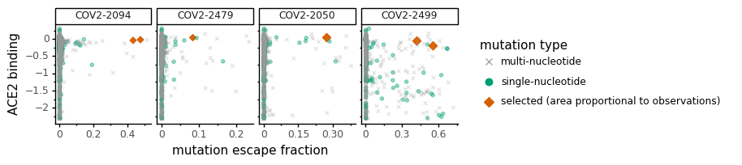

# Analyze escape-mutant selections
Analyze some data from escape-mutant selections by Pavel in Crowe lab.

Import Python modules:


```python
import os

import Bio.SeqIO

import dms_variants.constants
from dms_variants.constants import CBPALETTE
import dms_variants.utils

from IPython.display import display, HTML

import mizani

import numpy

import pandas as pd

from plotnine import *

import yaml
```

Read in configuration and then escape-mutant selection results:


```python
with open('config.yaml') as f:
    config = yaml.safe_load(f)
    
print(f"Reading escape-mutant selection results from {config['escape_selection_results']}")
with open(config['escape_selection_results']) as f:
    selection_results = yaml.safe_load(f)
```

    Reading escape-mutant selection results from data/escape_selection_results.yaml


Make output directory:


```python
os.makedirs(config['escape_selections_dir'], exist_ok=True)
```

Read escape-mutation mapping and deep mutational scanning results, and then merge them:


```python
# read escape fractions
escape_fracs = (
    pd.read_csv(config['escape_fracs'])
    .query('library == "average"')
    .rename(columns={config['mut_metric']: 'mutation_escape',
                     config['site_metric']: 'site_escape'})
    .assign(site=lambda x: x['label_site'],
            antibody=lambda x: x['selection'].str.split('_').str[0])
    [['selection', 'antibody', 'site', 'wildtype', 'mutation', 'mutation_escape', 'site_escape']]
    )

# check that antibody names extracted from selections are unique, which would not be
# the case if just removing text after underscore doesn't get antibody name
assert escape_fracs['antibody'].nunique() == escape_fracs['selection'].nunique()

# read DMS data
bind_expr = (
    pd.read_csv(config['mut_bind_expr'])
    .rename(columns={'site_SARS2': 'site',
                     'bind_avg': 'ACE2 binding',
                     'expr_avg': 'RBD expression',
                     })
    .assign(mutation=lambda x: x['mutant'])
    [['site', 'mutation', 'ACE2 binding', 'RBD expression']]
    )

# merge escape and DMS data
escape_dms = (
    escape_fracs
    .merge(bind_expr,
           on=['site', 'mutation'],
           how='left',
           validate='many_to_one',
           )
    )

# first few lines of data frame
display(HTML(escape_dms.head().to_html(index=False)))
```


<table border="1" class="dataframe">
  <thead>
    <tr style="text-align: right;">
      <th>selection</th>
      <th>antibody</th>
      <th>site</th>
      <th>wildtype</th>
      <th>mutation</th>
      <th>mutation_escape</th>
      <th>site_escape</th>
      <th>ACE2 binding</th>
      <th>RBD expression</th>
    </tr>
  </thead>
  <tbody>
    <tr>
      <td>COV2-2050_400</td>
      <td>COV2-2050</td>
      <td>331</td>
      <td>N</td>
      <td>A</td>
      <td>0.000366</td>
      <td>0.0335</td>
      <td>-0.03</td>
      <td>-0.11</td>
    </tr>
    <tr>
      <td>COV2-2050_400</td>
      <td>COV2-2050</td>
      <td>331</td>
      <td>N</td>
      <td>C</td>
      <td>0.001012</td>
      <td>0.0335</td>
      <td>-0.09</td>
      <td>-1.26</td>
    </tr>
    <tr>
      <td>COV2-2050_400</td>
      <td>COV2-2050</td>
      <td>331</td>
      <td>N</td>
      <td>D</td>
      <td>0.000373</td>
      <td>0.0335</td>
      <td>0.03</td>
      <td>-0.44</td>
    </tr>
    <tr>
      <td>COV2-2050_400</td>
      <td>COV2-2050</td>
      <td>331</td>
      <td>N</td>
      <td>E</td>
      <td>0.005233</td>
      <td>0.0335</td>
      <td>0.00</td>
      <td>-0.31</td>
    </tr>
    <tr>
      <td>COV2-2050_400</td>
      <td>COV2-2050</td>
      <td>331</td>
      <td>N</td>
      <td>F</td>
      <td>0.001505</td>
      <td>0.0335</td>
      <td>-0.10</td>
      <td>-0.70</td>
    </tr>
  </tbody>
</table>


Get data frame with just escape-selection counts and then add to the main data frame of escape / DMS data:


```python
records = []
for antibody, d in selection_results.items():
    if 'mutations' in d:
        for mutation_str, n in d['mutations'].items():
            wt = mutation_str[0]
            site = int(mutation_str[1: -1])
            mutation = mutation_str[-1]
            records.append((antibody, site, wt, mutation, n))
            assert 1 == len(escape_dms.query('antibody == @antibody')
                                      .query('wildtype == @wt')
                                      .query('site == @site')
                                      .query('mutation == @mutation')
                                      ), f"{mutation_str} not in `escape_dms` once for {antibody}"
            
selection_df = pd.DataFrame.from_records(
                records,
                columns=['antibody', 'site', 'wildtype', 'mutation', 'n_selected'])

antibody_order = selection_df['antibody'].unique().tolist()

display(HTML(selection_df.to_html(index=False)))
```


<table border="1" class="dataframe">
  <thead>
    <tr style="text-align: right;">
      <th>antibody</th>
      <th>site</th>
      <th>wildtype</th>
      <th>mutation</th>
      <th>n_selected</th>
    </tr>
  </thead>
  <tbody>
    <tr>
      <td>COV2-2094</td>
      <td>378</td>
      <td>K</td>
      <td>E</td>
      <td>1</td>
    </tr>
    <tr>
      <td>COV2-2094</td>
      <td>378</td>
      <td>K</td>
      <td>N</td>
      <td>1</td>
    </tr>
    <tr>
      <td>COV2-2479</td>
      <td>484</td>
      <td>E</td>
      <td>K</td>
      <td>1</td>
    </tr>
    <tr>
      <td>COV2-2050</td>
      <td>484</td>
      <td>E</td>
      <td>K</td>
      <td>2</td>
    </tr>
    <tr>
      <td>COV2-2499</td>
      <td>446</td>
      <td>G</td>
      <td>D</td>
      <td>2</td>
    </tr>
    <tr>
      <td>COV2-2499</td>
      <td>498</td>
      <td>Q</td>
      <td>R</td>
      <td>2</td>
    </tr>
  </tbody>
</table>


Add escape-selection counts to main data frame and then get just antibodies with at least one escape-mutation selected:


```python
escape_dms_selection = (
    escape_dms
    .merge(selection_df,
           how='left',
           on=['antibody', 'site', 'wildtype', 'mutation'],
           validate='one_to_one',
           )
    .assign(n_selected=lambda x: x['n_selected'].fillna(0).astype(int),
            n_selected_total=lambda x: x.groupby('antibody')['n_selected'].transform('sum'),
            any_selected=lambda x: x['n_selected'] > 0,
            )
    .query('n_selected_total > 0')
    .reset_index(drop=True)
    )

display(HTML(escape_dms_selection.head().to_html(index=False)))
```


<table border="1" class="dataframe">
  <thead>
    <tr style="text-align: right;">
      <th>selection</th>
      <th>antibody</th>
      <th>site</th>
      <th>wildtype</th>
      <th>mutation</th>
      <th>mutation_escape</th>
      <th>site_escape</th>
      <th>ACE2 binding</th>
      <th>RBD expression</th>
      <th>n_selected</th>
      <th>n_selected_total</th>
      <th>any_selected</th>
    </tr>
  </thead>
  <tbody>
    <tr>
      <td>COV2-2050_400</td>
      <td>COV2-2050</td>
      <td>331</td>
      <td>N</td>
      <td>A</td>
      <td>0.000366</td>
      <td>0.0335</td>
      <td>-0.03</td>
      <td>-0.11</td>
      <td>0</td>
      <td>2</td>
      <td>False</td>
    </tr>
    <tr>
      <td>COV2-2050_400</td>
      <td>COV2-2050</td>
      <td>331</td>
      <td>N</td>
      <td>C</td>
      <td>0.001012</td>
      <td>0.0335</td>
      <td>-0.09</td>
      <td>-1.26</td>
      <td>0</td>
      <td>2</td>
      <td>False</td>
    </tr>
    <tr>
      <td>COV2-2050_400</td>
      <td>COV2-2050</td>
      <td>331</td>
      <td>N</td>
      <td>D</td>
      <td>0.000373</td>
      <td>0.0335</td>
      <td>0.03</td>
      <td>-0.44</td>
      <td>0</td>
      <td>2</td>
      <td>False</td>
    </tr>
    <tr>
      <td>COV2-2050_400</td>
      <td>COV2-2050</td>
      <td>331</td>
      <td>N</td>
      <td>E</td>
      <td>0.005233</td>
      <td>0.0335</td>
      <td>0.00</td>
      <td>-0.31</td>
      <td>0</td>
      <td>2</td>
      <td>False</td>
    </tr>
    <tr>
      <td>COV2-2050_400</td>
      <td>COV2-2050</td>
      <td>331</td>
      <td>N</td>
      <td>F</td>
      <td>0.001505</td>
      <td>0.0335</td>
      <td>-0.10</td>
      <td>-0.70</td>
      <td>0</td>
      <td>2</td>
      <td>False</td>
    </tr>
  </tbody>
</table>


Now add in the Spike VSV codon sequence and determine what amino-acid mutations are single-nucleotide accessible:


```python
print(f"Reading Spike codon sequence from {config['vsv_spike']}")
spike = str(Bio.SeqIO.read(config['vsv_spike'], 'genbank').seq)

escape_dms_selection = (
    escape_dms_selection
    .assign(VSV_codon=lambda x: x['site'].map(lambda r: spike[3 * (r - 1): 3 * r]),
            VSV_aa=lambda x: x['VSV_codon'].map(dms_variants.constants.CODON_TO_AA),
            single_nt_accessible=lambda x: x.apply(lambda row: dms_variants.utils.single_nt_accessible(row['VSV_codon'],
                                                                                                       row['mutation']),
                                                   axis=1)
            )
    )

if any(escape_dms_selection['wildtype'] != escape_dms_selection['VSV_aa']):
    raise ValueError('VSV differs from DMS RBD amino-acid sequence')
```

    Reading Spike codon sequence from data/VSV-SARS-CoV-2-Spike.gb


Make plots showing effects of all mutations stratified by how many times observed in selections, and whether single-nucleotide accessible or not from VSV spike.
For mutations observed in selections point size is proportional to times observed:


```python
max_selected = escape_dms_selection['n_selected'].max()
n_antibodies = escape_dms_selection['antibody'].nunique()


# assign area for points, proportional to n_selected but always at least 0.5 so even
# unselected points are visible, and categorize points by not single-nucleotide accessible,
# single-nucleotide accessible and no-escape, or escape
cat_labels = {0: 'multi-nucleotide',
              1: 'single-nucleotide',
              2: 'selected (area proportional to observations)',
              }
df = escape_dms_selection.assign(
        antibody=lambda x: pd.Categorical(x['antibody'], antibody_order, ordered=True),
        point_area=lambda x: numpy.clip(x['n_selected'], 0.5, None),
        # 0 for not single-nt accessible, 1 for single-nt accessible but not selected, 2 for selected and single-nt accessible
        point_category_int=lambda x: x['any_selected'].astype(int) + x['single_nt_accessible'],
        point_category=lambda x: pd.Categorical(x['point_category_int'].map(cat_labels), cat_labels.values(), ordered=True)
        )
assert not len(df.query('any_selected and not single_nt_accessible')), 'categories above do not work'
    
p = (ggplot(df) +
     aes('mutation_escape', 'ACE2 binding',
         color='point_category', alpha='point_category',
         size='point_area', shape='point_category') +
     geom_point() +
     facet_wrap('~ antibody', nrow=1, scales='free_x') +
     scale_color_manual(values=[CBPALETTE[0], CBPALETTE[3], CBPALETTE[6]]) +
     scale_alpha_manual(values=[0.3, 0.4, 0.95]) +
     scale_size_area(max_size=2.5) +
     scale_shape_manual(values=['x', 'o', 'D']) +
     theme_classic() +
     scale_x_continuous(name='mutation escape fraction',
                        breaks=mizani.breaks.mpl_breaks(nbins=3),
                        ) +
     guides(alpha=False, size=False,
            shape=guide_legend(override_aes={'size': 3},
                               title='mutation type'),
            color=guide_legend(title='mutation type'),
            ) +
     theme(figure_size=(1.6 * n_antibodies, 1.6))
    )
     
_ = p.draw()

plotfile = os.path.join(config['escape_selections_dir'], 'mutations_scatter.pdf')
print(f"Saving plot to {plotfile}")
p.save(plotfile, verbose=False)
```

    Saving plot to results/escape_selections/mutations_scatter.pdf


    /fh/fast/bloom_j/computational_notebooks/jbloom/2020/SARS-CoV-2-RBD_MAP/env/lib/python3.7/site-packages/plotnine/guides/guide_legend.py:126: PlotnineWarning: Duplicated override_aes is ignored.
      warn("Duplicated override_aes is ignored.", PlotnineWarning)





```python

```
