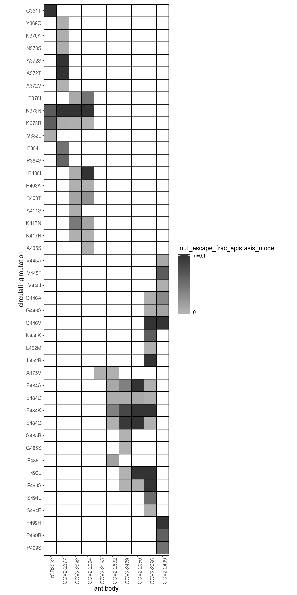
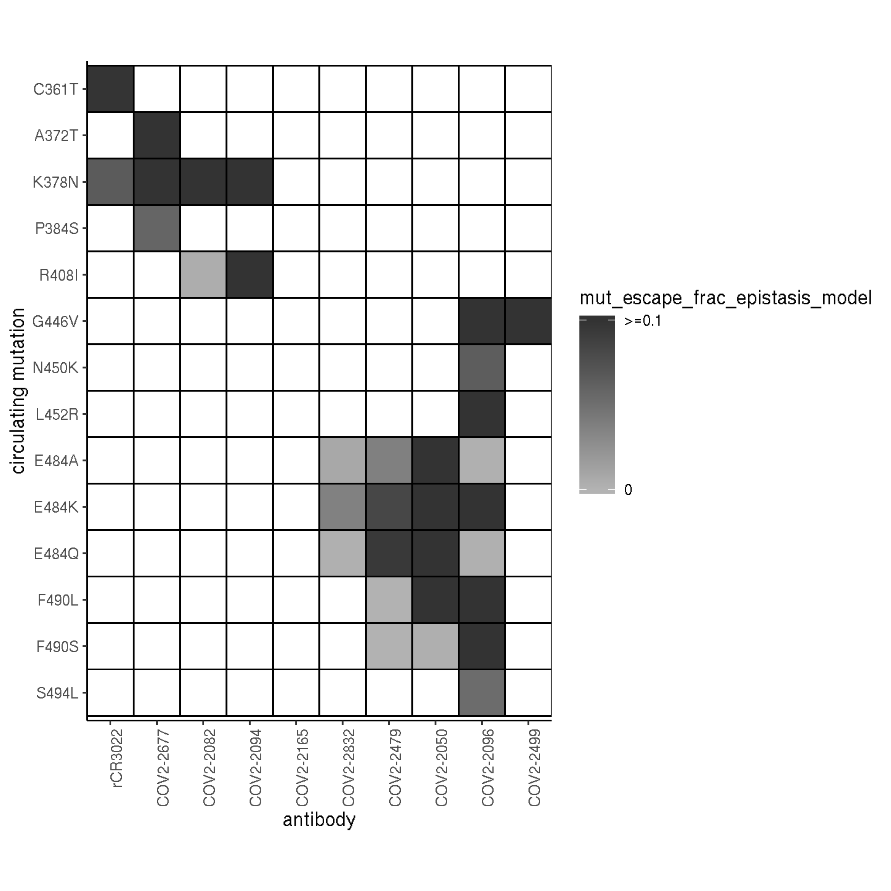

Evolution and escape for Crowe mAbs + rCR3022
================
8/14/2020

  - [Setup](#setup)
  - [Sarbecovirus conservation at sites of
    escape](#sarbecovirus-conservation-at-sites-of-escape)
  - [DMS functional constraint at sites of
    escape](#dms-functional-constraint-at-sites-of-escape)
  - [Circulating mutants at sites of
    escape](#circulating-mutants-at-sites-of-escape)

This notebook analyzes mAb escape scores for SARS-CoV-2 mAbs in light of
evolutionary and functional considerations. This includes comparison to
evolutionary conservation of positions among sarbecoviruses,
consideration of circulating variants in current pandemic isolates, and
relating escape scores to consideration of functional constraint from
our deep mutational scanning measurements.

## Setup

``` r
#list of packages to install/load
packages = c("yaml","data.table","tidyverse","gridExtra","bio3d","knitr","seqinr")
#install any packages not already installed
installed_packages <- packages %in% rownames(installed.packages())
if(any(installed_packages == F)){
  install.packages(packages[!installed_packages])
}
#load packages
lapply(packages, library, character.only=T)
```

    ## [[1]]
    ## [1] "yaml"      "stats"     "graphics"  "grDevices" "utils"     "datasets" 
    ## [7] "methods"   "base"     
    ## 
    ## [[2]]
    ## [1] "data.table" "yaml"       "stats"      "graphics"   "grDevices" 
    ## [6] "utils"      "datasets"   "methods"    "base"      
    ## 
    ## [[3]]
    ##  [1] "forcats"    "stringr"    "dplyr"      "purrr"      "readr"     
    ##  [6] "tidyr"      "tibble"     "ggplot2"    "tidyverse"  "data.table"
    ## [11] "yaml"       "stats"      "graphics"   "grDevices"  "utils"     
    ## [16] "datasets"   "methods"    "base"      
    ## 
    ## [[4]]
    ##  [1] "gridExtra"  "forcats"    "stringr"    "dplyr"      "purrr"     
    ##  [6] "readr"      "tidyr"      "tibble"     "ggplot2"    "tidyverse" 
    ## [11] "data.table" "yaml"       "stats"      "graphics"   "grDevices" 
    ## [16] "utils"      "datasets"   "methods"    "base"      
    ## 
    ## [[5]]
    ##  [1] "bio3d"      "gridExtra"  "forcats"    "stringr"    "dplyr"     
    ##  [6] "purrr"      "readr"      "tidyr"      "tibble"     "ggplot2"   
    ## [11] "tidyverse"  "data.table" "yaml"       "stats"      "graphics"  
    ## [16] "grDevices"  "utils"      "datasets"   "methods"    "base"      
    ## 
    ## [[6]]
    ##  [1] "knitr"      "bio3d"      "gridExtra"  "forcats"    "stringr"   
    ##  [6] "dplyr"      "purrr"      "readr"      "tidyr"      "tibble"    
    ## [11] "ggplot2"    "tidyverse"  "data.table" "yaml"       "stats"     
    ## [16] "graphics"   "grDevices"  "utils"      "datasets"   "methods"   
    ## [21] "base"      
    ## 
    ## [[7]]
    ##  [1] "seqinr"     "knitr"      "bio3d"      "gridExtra"  "forcats"   
    ##  [6] "stringr"    "dplyr"      "purrr"      "readr"      "tidyr"     
    ## [11] "tibble"     "ggplot2"    "tidyverse"  "data.table" "yaml"      
    ## [16] "stats"      "graphics"   "grDevices"  "utils"      "datasets"  
    ## [21] "methods"    "base"

``` r
knitr::opts_chunk$set(echo = T)
knitr::opts_chunk$set(dev.args = list(png = list(type = "cairo")))

#read in config file
config <- read_yaml("config.yaml")

#read in file giving concordance between RBD numbering and SARS-CoV-2 Spike numbering, along with other per-site annotations
RBD_sites <- read.csv(config$RBD_sites,stringsAsFactors = F)

#make output directory
output_dir <- config$crowe_evolution_dir
if(!file.exists(output_dir)){
  dir.create(file.path(output_dir))
}

cbPalette <- c("#999999", "#E69F00", "#56B4E9", "#009E73", "#F0E442", "#0072B2", "#D55E00", "#CC79A7")
```

Session info for reproducing environment:

``` r
sessionInfo()
```

    ## R version 3.6.1 (2019-07-05)
    ## Platform: x86_64-pc-linux-gnu (64-bit)
    ## Running under: Ubuntu 18.04.4 LTS
    ## 
    ## Matrix products: default
    ## BLAS/LAPACK: /app/software/OpenBLAS/0.3.1-GCC-7.3.0-2.30/lib/libopenblas_haswellp-r0.3.1.so
    ## 
    ## locale:
    ##  [1] LC_CTYPE=en_US.UTF-8       LC_NUMERIC=C              
    ##  [3] LC_TIME=en_US.UTF-8        LC_COLLATE=en_US.UTF-8    
    ##  [5] LC_MONETARY=en_US.UTF-8    LC_MESSAGES=en_US.UTF-8   
    ##  [7] LC_PAPER=en_US.UTF-8       LC_NAME=C                 
    ##  [9] LC_ADDRESS=C               LC_TELEPHONE=C            
    ## [11] LC_MEASUREMENT=en_US.UTF-8 LC_IDENTIFICATION=C       
    ## 
    ## attached base packages:
    ## [1] stats     graphics  grDevices utils     datasets  methods   base     
    ## 
    ## other attached packages:
    ##  [1] seqinr_3.6-1      knitr_1.25        bio3d_2.3-4      
    ##  [4] gridExtra_2.3     forcats_0.4.0     stringr_1.4.0    
    ##  [7] dplyr_0.8.3       purrr_0.3.3       readr_1.3.1      
    ## [10] tidyr_1.0.0       tibble_3.0.2      ggplot2_3.2.1    
    ## [13] tidyverse_1.2.1   data.table_1.12.6 yaml_2.2.0       
    ## 
    ## loaded via a namespace (and not attached):
    ##  [1] Rcpp_1.0.2       cellranger_1.1.0 pillar_1.4.5     compiler_3.6.1  
    ##  [5] tools_3.6.1      digest_0.6.22    lubridate_1.7.4  jsonlite_1.6    
    ##  [9] evaluate_0.14    lifecycle_0.2.0  gtable_0.3.0     pkgconfig_2.0.3 
    ## [13] rlang_0.4.7      cli_1.1.0        rstudioapi_0.10  parallel_3.6.1  
    ## [17] haven_2.1.1      xfun_0.10        withr_2.1.2      xml2_1.2.2      
    ## [21] httr_1.4.1       generics_0.0.2   vctrs_0.3.1      hms_0.5.2       
    ## [25] ade4_1.7-13      grid_3.6.1       tidyselect_1.1.0 glue_1.3.1      
    ## [29] R6_2.4.0         readxl_1.3.1     rmarkdown_1.16   modelr_0.1.5    
    ## [33] magrittr_1.5     MASS_7.3-51.4    backports_1.1.5  scales_1.0.0    
    ## [37] ellipsis_0.3.0   htmltools_0.4.0  rvest_0.3.4      assertthat_0.2.1
    ## [41] colorspace_1.4-1 stringi_1.4.3    lazyeval_0.2.2   munsell_0.5.0   
    ## [45] broom_0.7.0      crayon_1.3.4

Load in relevant data for analyses: escape scores for the Crowe mAbs,
deep mutational scanning scores, and sites of significant escape for
these antibodies.

``` r
dms <- read.csv(file=config$mut_bind_expr,stringsAsFactors = F)
dt <- data.table(read.csv(file=config$escape_fracs,stringsAsFactors=F))
#filter to just the mAbs in this main paper, and just the average escape frac from the two libraries
dt <- dt[selection %in% c("COV2-2050_400","COV2-2082_400","COV2-2094_400","COV2-2096_400","COV2-2165_400","COV2-2479_400",
                          "COV2-2499_400","COV2-2677_400","COV2-2832_400","CR3022_400"),];dt <- dt[library=="average",]

#add dms bind and expression phenotype for each mutation
dt[,dms_bind := dms[dms$site_SARS2 == label_site & dms$mutant == mutation,"bind_avg"],by=c("label_site","mutation")]
dt[,dms_expr := dms[dms$site_SARS2 == label_site & dms$mutant == mutation,"expr_avg"],by=c("label_site","mutation")]

#read in table of sites of strong escape, filter the table for just the sites for these antibodies
strong_sites <- read.csv(file=config$significant_escape_sites,stringsAsFactors=F)
strong_sites <- strong_sites[strong_sites$condition %in% c("COV2-2050_400","COV2-2082_400","COV2-2094_400","COV2-2096_400","COV2-2165_400",
                                                           "COV2-2479_400","COV2-2499_400","COV2-2677_400","COV2-2832_400","CR3022_400"),]

#read in table giving escape fraction for sarbecovirus homologs in the libraries, filter the table for just these antibodies
homologs <- read.csv(file=config$escape_fracs_homologs,stringsAsFactors=F); homologs <- homologs[homologs$library == "average",]
homologs <- homologs[homologs$selection %in% c("COV2-2050_400","COV2-2082_400","COV2-2094_400","COV2-2096_400","COV2-2165_400",
                                               "COV2-2479_400","COV2-2499_400","COV2-2677_400","COV2-2832_400","CR3022_400"),]

#rename without the _400 for simpler names
for(i in 1:nrow(strong_sites)){
  strong_sites$condition[i] <- strsplit(strong_sites$condition[i],split="_")[[1]][1]
}
for(i in 1:nrow(dt)){
  dt$selection[i] <- strsplit(dt$selection[i],split="_")[[1]][1]
}
for(i in 1:nrow(homologs)){
  homologs$selection[i] <- strsplit(homologs$selection[i],split="_")[[1]][1]
}

#rename CR3022 to rCR3022
strong_sites[strong_sites$condition=="CR3022","condition"] <- "rCR3022"
homologs[homologs$selection=="CR3022","selection"] <- "rCR3022"
dt[selection=="CR3022",selection:="rCR3022"]

#in homologs, rename SARS-CoV to SARS-CoV-1
homologs[homologs$homolog=="SARS-CoV","homolog"] <- "SARS-CoV-1"

#set order for factors to auto-plot in desired order
strong_sites$condition <- factor(strong_sites$condition, levels=c("rCR3022","COV2-2677","COV2-2082","COV2-2094","COV2-2165",
                                                                  "COV2-2832","COV2-2479","COV2-2050","COV2-2096","COV2-2499"))
dt$selection <- factor(dt$selection, levels=c("rCR3022","COV2-2677","COV2-2082","COV2-2094","COV2-2165",
                                              "COV2-2832","COV2-2479","COV2-2050","COV2-2096","COV2-2499"))
homologs$selection <- factor(homologs$selection, levels=c("rCR3022","COV2-2677","COV2-2082","COV2-2094","COV2-2165",
                                                          "COV2-2832","COV2-2479","COV2-2050","COV2-2096","COV2-2499"))
homologs$homolog <- factor(homologs$homolog, levels=c("SARS-CoV-2","GD-Pangolin","RaTG13","SARS-CoV-1","WIV16","LYRa11"))

#read in list of escape mutations from prior papers selecting viral escape mutants in cell culture antibody treatment
lit_escapes <- read.csv(file=config$literature_escapes,stringsAsFactors = F); lit_escapes <- lit_escapes[lit_escapes$study_short %in% c("Regeneron","NYC"),]
for(i in 1:nrow(lit_escapes)){
  lit_escapes$dms_bind[i] <- dms[dms$mutation == lit_escapes$mutation[i],"bind_avg"]
  lit_escapes$dms_expr[i] <- dms[dms$mutation == lit_escapes$mutation[i],"expr_avg"]
}

#what's the 95th percentile in bind and expr escape scores among these lit mutants?
bind_threshold <- as.numeric(quantile(lit_escapes$dms_bind,0.05))
expr_threshold <- as.numeric(quantile(lit_escapes$dms_expr,0.05))

#read in table of GISAID mut counts for all RBD sites
circ_muts <- read.csv(file=config$circulating_variants,stringsAsFactors = F)
```

We define several indicator variables in the per-mutation `dt` that we
will use at the per-mutation level for some slicing and dicing. We also
add some summary stats about mutations in the `strong_sites` table. We
do this all up here, so it’s easier to change at the global level for
all subsequent plots.

``` r
#add full character of the mutation name
dt[,mutation_full := paste(wildtype,protein_site,mutation,sep="")]
dt$mutation_full <- factor(dt$mutation_full,levels=unique(dt$mutation_full))

#in the per-mut escape data table, we want an indicator of whether a mutation is at a site of strong escape
for(i in 1:nrow(dt)){
  if(nrow(strong_sites[strong_sites$condition == dt[i,selection] & strong_sites$site == dt[i,label_site],])==1){
    dt$strong_site[i] <- T
  }else{
    dt$strong_site[i] <- F
  }
}

#indicator for whether a mut is strong escape -- currently, just < or >5% escape
for(i in 1:nrow(dt)){
  if(dt$mut_escape_frac_epistasis_model[i]>0.05){
    dt$strong_escape_indicator[i] <- T
  }else{
    dt$strong_escape_indicator[i] <- F
  }
}


#define a function that takes a character of three nucleotides (a codon), and outputs all amino acids that can be accessed via single-nt mutation of that codon
get.codon.muts <- function(codon){
  nt <- c("a","c","g","t")
  codon_split <- strsplit(codon,split="")[[1]]
  codon_muts <- vector()
  for(i in nt[nt!=codon_split[1]]){
    codon_muts <- c(codon_muts,seqinr::translate(c(i,codon_split[2:3])))
  }
  for(i in nt[nt!=codon_split[2]]){
    codon_muts <- c(codon_muts,seqinr::translate(c(codon_split[1],i,codon_split[3])))
  }
  for(i in nt[nt!=codon_split[3]]){
    codon_muts <- c(codon_muts,seqinr::translate(c(codon_split[1:2],i)))
  }
  return(codon_muts)
}

#annotate mutations if they're single-nt accessible from the Wuhan-Hu-1 sequence
dt[,SARS2_codon:=RBD_sites[RBD_sites$site_SARS2==protein_site,"codon_SARS2"],by=protein_site]
dt[,singlemut := mutation %in% get.codon.muts(SARS2_codon),by=mutation_full]

#add per-mut nobs from GISAID to dt table
dt[,nobs := circ_muts[circ_muts$site_SARS2==label_site & circ_muts$mutant==mutation,"nobs"],by=c("label_site","mutation")]
dt[,ngeo := circ_muts[circ_muts$site_SARS2==label_site & circ_muts$mutant==mutation,"ngeo"],by=c("label_site","mutation")]


#site-wise annotations

#add site sum, site max escape values to strong_sites table
for(i in 1:nrow(strong_sites)){
  strong_sites$sum_escape[i] <- dt[selection==strong_sites$condition[i] & label_site==strong_sites$site[i],site_total_escape_frac_epistasis_model][1]
  strong_sites$max_escape[i] <- max(dt[selection==strong_sites$condition[i] & label_site==strong_sites$site[i], mut_escape_frac_single_mut])
}

#add mean bind and expr DMS measurements per site
for(i in 1:nrow(strong_sites)){
  strong_sites$mean_bind[i] <- mean(dms[dms$site_SARS2==strong_sites$site[i] & dms$mutant != dms$wildtype & dms$mutant != "*", "bind_avg"],na.rm=T)
  strong_sites$mean_expr[i] <- mean(dms[dms$site_SARS2==strong_sites$site[i] & dms$mutant != dms$wildtype & dms$mutant != "*", "expr_avg"],na.rm=T)
}

#add Neff alignment conservation of each site of strong escape
#read in an alignment of sarbecovirus RBDs
alignment <- bio3d::read.fasta(file=config$sarbecovirus_alignment)
#remove columns that is gap in the SARS-CoV-2 sequence (only one is a single A insertion in the BM48-31 sequence)
alignment$ali <- alignment$ali[,which(alignment$ali[1,]!="-")]

#calculate entropy, Neff at each site in the alignment
entropy <- entropy(alignment)$H
RBD_sites$entropy <- entropy
RBD_sites$Neff <- 2^(entropy)

#annotate strong sites table with the sarbecovirus alignment Neff
for(i in 1:nrow(strong_sites)){
  strong_sites$Neff[i] <- RBD_sites[RBD_sites$site_SARS2==strong_sites$site[i],"Neff"]
}

#for each site, sum the number of observed muts among GISAID sequences
for(i in 1:nrow(strong_sites)){
  strong_sites$n_gisaid_counts[i] <- sum(circ_muts[circ_muts$site_SARS2==strong_sites$site[i],"nobs"])
  strong_sites$n_gisaid_muts[i] <- sum(circ_muts[circ_muts$site_SARS2==strong_sites$site[i],"nobs"]>0)
}
```

## Sarbecovirus conservation at sites of escape

First, let’s visualize the average sarbecovirus homolog binding/escape
score as table/heatmaps.


Next, let’s look at the conservation of amino acid residues that are
strongly selected by each mAb. To look at this, we calculate `Neff` from
the sarbecovirus RBD alignment given in `config$sarbecovirus_alignment`.
We also compute a “restricted” sarbecovirus set `Neff_restricted`, which
is computed from the SARS-CoV-1 and -2 clade sequences, the only ones
known to bind ACE2 (and for which neutralizing breadth would be
particularly important). This does create a quite small alignment,
though, so it is unclear how well these `Neff_restricted` metrics
reflect evolutionary constraint.

``` r
#plot as a boxplot, for each position of strong escape for each antibody
p1 <- ggplot(strong_sites,aes(x=condition,y=Neff))+
        geom_boxplot(outlier.shape=NA, width=0.3, outlier.alpha=0.25)+
        geom_jitter(width=0.1, height=0, alpha=0.25, shape=16)+
        theme_classic()+
        xlab("antibody")+ylab("N_eff per site of escape")+theme(axis.text.x=element_text(angle=90,hjust=1))

grid.arrange(p1,nrow=1)
```


``` r
invisible(dev.print(pdf, paste(output_dir,"/distribution-Neff_per_epitope.pdf",sep=""), useDingbats=F))
```

## DMS functional constraint at sites of escape

What is the constraint per position (from our DMS measurements) for each
antibody’s set of escape sites? We can do two things here – look at the
average effect per site (general constraint), and look at the intrinsic
constraint for particular escape mutations (specific constraint).

The first plots below show the mean mutation effect per site on binding
(left) and expression (right) for sites of significant escape from each
mAb. We don’t know exactly what the cutoff is for tolerability of real
escape mutations with side-effects on binding or expression – however,
we can use previous sets of selected escape mutations in lab/cell
culture antibody selections, to see what range of phenotypic values are
observed in these “lab-selected” escape mutations, which Allie collated
in a table `config$literature_escapes`. The dashed lines on these plots
are the 95th percentile of binding and expression DMS scores for these
lab-selected escape mutations (or is it 5th percentile? 95% of
lab-escape mutants have binding/expression this value or higher).

``` r
p1 <- ggplot(strong_sites,aes(x=condition,y=mean_bind))+
        geom_boxplot(outlier.shape=NA, width=0.3, outlier.alpha=0.5)+
        geom_jitter(width=0.1, height=0, alpha=0.25, shape=16)+
        theme_classic()+
        xlab("antibody")+ylab("mean binding effect per site")+theme(axis.text.x=element_text(angle=90,hjust=1))

p2 <- ggplot(strong_sites,aes(x=condition,y=mean_expr))+
        geom_boxplot(outlier.shape=NA, width=0.3, outlier.alpha=0.5)+
        geom_jitter(width=0.1, height=0, alpha=0.25, shape=16)+
        theme_classic()+
        xlab("antibody")+ylab("mean expression effect per site")+theme(axis.text.x=element_text(angle=90,hjust=1))

grid.arrange(p1,p2,nrow=1)
```


``` r
invisible(dev.print(pdf, paste(output_dir,"/distribution_mean-dms-score_per_epitope.pdf",sep=""), useDingbats=F))
```

Next, for each mAb, we make exploratory plots showing the effect of
individual mutations at sites of significant escape on DMS binding or
expression versus antibody escape.

``` r
par(mfrow=c(length(levels(dt$selection)),2))
for(mAb in levels(dt$selection)){
  plot(dt[selection==mAb & label_site %in% strong_sites[strong_sites$condition==mAb,"site"],mut_escape_frac_epistasis_model],
     dt[selection==mAb & label_site %in% strong_sites[strong_sites$condition==mAb,"site"],dms_bind],
     xlab="fraction escape",ylab="DMS binding score",main=mAb,pch=16,
     xlim=range(dt$mut_escape_frac_epistasis_model),ylim=range(dt[label_site %in% strong_sites$site,dms_bind])); abline(h=bind_threshold,lty=2,col="gray50")
  plot(dt[selection==mAb & label_site %in% strong_sites[strong_sites$condition==mAb,"site"],mut_escape_frac_epistasis_model],
       dt[selection==mAb & label_site %in% strong_sites[strong_sites$condition==mAb,"site"],dms_expr],
       xlab="fraction escape",ylab="DMS expression score",main=mAb,pch=16,
       xlim=range(dt$mut_escape_frac_epistasis_model),ylim=range(dt[label_site %in% strong_sites$site,dms_expr])); abline(h=expr_threshold,lty=2,col="gray50")
}
```


``` r
invisible(dev.print(pdf, paste(output_dir,"/plots_dms-score_per_mut.pdf",sep=""), useDingbats=F))
```

Let’s look at DMS constraint at the per-mut level, differentiating
mutations that confer strong ecape from those that do not.

``` r
p1 <- ggplot(dt[strong_site==T,],aes(x=selection,y=dms_bind))+
        geom_boxplot(outlier.shape=NA, width=0.5,aes(fill=strong_escape_indicator))+
        scale_fill_manual(values=cbPalette[c(5,6)])+
        theme_classic()+
        xlab("antibody")+ylab("dms binding effect of mut")+theme(axis.text.x=element_text(angle=90,hjust=1))+
        geom_hline(yintercept=bind_threshold, linetype=2, color="gray50")

p2 <- ggplot(dt[strong_site==T,],aes(x=selection,y=dms_expr,fill=strong_escape_indicator))+
        geom_boxplot(outlier.shape=NA, width=0.5)+
        scale_fill_manual(values=cbPalette[c(5,6)])+
        #geom_jitter(width=0.1, height=0, alpha=0.5, shape=16)+
        theme_classic()+
        xlab("antibody")+ylab("dms expression effect of mut")+theme(axis.text.x=element_text(angle=90,hjust=1))+
        geom_hline(yintercept=bind_threshold, linetype=2, color="gray50")

grid.arrange(p1,p2,nrow=2)
```


``` r
invisible(dev.print(pdf, paste(output_dir,"/boxplots_dms-score_per_mut_split-by-escape.pdf",sep=""), useDingbats=F))
```

## Circulating mutants at sites of escape

Finally, let’s look at the number of ciruclating amino-acid variants
within sites of escape from mAb. We can look at general prevalence of
mutations within these sites, as well as the prevalence of specific
escape mutations (that is, factoring in that we don’t always see that
all mutations at a significant site confer escape).

First looking more generally, on the top is the number GISAID sequecnes
that have an amino-acid mutation at a site of escape for each antibody.
On the bottom is the total number of mutant amino acids that are
observed at each site of escape for each mAb.

``` r
p1 <- ggplot(strong_sites,aes(x=condition,y=n_gisaid_counts))+
        #geom_boxplot(outlier.shape=NA, width=0.3, outlier.alpha=0.25)+
        geom_jitter(width=0.1, height=0, alpha=0.25, shape=16)+
        theme_classic()+
        xlab("antibody")+ylab("number GISAID seqs with mut at epitope site")+theme(axis.text.x=element_text(angle=90,hjust=1))

p2 <- ggplot(strong_sites,aes(x=condition,y=n_gisaid_muts))+
        geom_boxplot(outlier.shape=NA, width=0.3, outlier.alpha=0.25)+
        geom_jitter(width=0.1, height=0, alpha=0.25, shape=16)+
        theme_classic()+
        xlab("antibody")+ylab("number of observed amino acids at epitope site")+theme(axis.text.x=element_text(angle=90,hjust=1))

grid.arrange(p1,p2, nrow=1)
```


``` r
invisible(dev.print(pdf, paste(output_dir,"/general-circ-mut-frequences_per_mAb.pdf",sep=""), useDingbats=F))
```

To consider more specifically the actual escape mutations, let’s look at
GISAID count versus fraction escape at the per-mut level.

``` r
p1 <- ggplot(dt[strong_site==T,],aes(x=mut_escape_frac_epistasis_model,y=nobs))+
        geom_point(alpha=0.25, shape=16)+
        theme_classic()+
        xlab("escape fraction")+ylab("number GISAID seqs with mut")+theme(axis.text.x=element_text(angle=90,hjust=1))
p1 + facet_grid(. ~ selection)
```


``` r
invisible(dev.print(pdf, paste(output_dir,"/specific-circ-mut-frequences_per_mAb_scatter.pdf",sep=""), useDingbats=F))
```

Finally, let’s just look in tabular form at mutants that have escape
fractions of \>5% and are found among circulating variants.

``` r
kable(dt[strong_site==T & nobs>0 & mut_escape_frac_epistasis_model > 0.05,][order(selection),.(selection, paste(wildtype,protein_site,mutation,sep=""), round(mut_escape_frac_epistasis_model,digits=2),nobs,ngeo,dms_bind,dms_expr)],col.names=c("antibody","mutation","escape fraction", "number GISAID sequences","number locations", "dms bind", "dms expr"))
```

| antibody  | mutation | escape fraction | number GISAID sequences | number locations | dms bind | dms expr |
| :-------- | :------- | --------------: | ----------------------: | ---------------: | -------: | -------: |
| rCR3022   | C361T    |            0.10 |                       4 |                1 |   \-0.61 |   \-1.08 |
| rCR3022   | K378N    |            0.07 |                       3 |                1 |   \-0.02 |   \-0.26 |
| rCR3022   | K378R    |            0.06 |                       1 |                1 |     0.08 |     0.16 |
| COV2-2677 | A372S    |            0.36 |                       1 |                1 |   \-0.19 |   \-0.45 |
| COV2-2677 | A372T    |            0.31 |                       2 |                1 |   \-0.16 |   \-0.28 |
| COV2-2677 | K378N    |            0.35 |                       3 |                1 |   \-0.02 |   \-0.26 |
| COV2-2677 | P384S    |            0.06 |                      11 |                8 |   \-0.09 |   \-0.38 |
| COV2-2082 | K378N    |            0.20 |                       3 |                1 |   \-0.02 |   \-0.26 |
| COV2-2094 | K378N    |            0.48 |                       3 |                1 |   \-0.02 |   \-0.26 |
| COV2-2094 | R408I    |            0.10 |                      14 |                4 |   \-0.09 |   \-0.46 |
| COV2-2479 | E484K    |            0.08 |                       9 |                4 |     0.06 |   \-0.10 |
| COV2-2479 | E484Q    |            0.09 |                      17 |                4 |     0.03 |   \-0.08 |
| COV2-2050 | E484A    |            0.29 |                       2 |                2 |   \-0.07 |   \-0.23 |
| COV2-2050 | E484K    |            0.27 |                       9 |                4 |     0.06 |   \-0.10 |
| COV2-2050 | E484Q    |            0.18 |                      17 |                4 |     0.03 |   \-0.08 |
| COV2-2050 | F490L    |            0.16 |                       5 |                3 |   \-0.11 |   \-0.35 |
| COV2-2096 | G446V    |            0.18 |                      18 |                9 |   \-0.27 |   \-0.48 |
| COV2-2096 | N450K    |            0.06 |                       2 |                2 |     0.04 |   \-0.01 |
| COV2-2096 | L452R    |            0.33 |                       2 |                2 |     0.02 |     0.32 |
| COV2-2096 | E484K    |            0.13 |                       9 |                4 |     0.06 |   \-0.10 |
| COV2-2096 | F490L    |            0.19 |                       5 |                3 |   \-0.11 |   \-0.35 |
| COV2-2096 | F490S    |            0.25 |                       8 |                1 |     0.00 |   \-0.10 |
| COV2-2096 | S494L    |            0.05 |                       3 |                3 |   \-0.35 |   \-1.02 |
| COV2-2499 | V445F    |            0.07 |                       1 |                1 |   \-0.10 |   \-0.24 |
| COV2-2499 | G446V    |            0.67 |                      18 |                9 |   \-0.27 |   \-0.48 |
| COV2-2499 | P499H    |            0.22 |                       1 |                1 |   \-0.47 |   \-0.51 |
| COV2-2499 | P499R    |            0.06 |                       1 |                1 |   \-0.14 |   \-0.58 |

Look at all circulating muts at sites of strong escape, regardless of
actual escape score. Sort by site rather than group by antibody

``` r
kable(dt[strong_site==T & nobs>0,][order(label_site,mutation,selection),.(paste(wildtype,protein_site,sep=""), mutation, nobs, selection, round(mut_escape_frac_epistasis_model,digits=2),dms_bind,dms_expr)],col.names=c("residue","mutation","# GISAID sequences", "antibody","escape fraction", "dms bind", "dms expr"))
```

| residue    | mutation    |   \# GISAID sequences | antibody    |    escape fraction |    dms bind |                                                                                                       dms expr |
| :--------- | :---------- | --------------------: | :---------- | -----------------: | ----------: | -------------------------------------------------------------------------------------------------------------: |
| C361       | T           |                     4 | rCR3022     |               0.10 |      \-0.61 |                                                                                                         \-1.08 |
| Y369       | C           |                     1 | COV2-2677   |               0.00 |      \-0.10 |                                                                                                         \-0.37 |
| N370       | K           |                     1 | COV2-2677   |               0.00 |      \-0.04 |                                                                                                         \-0.04 |
| N370       | S           |                    26 | COV2-2677   |               0.00 |      \-0.02 |                                                                                                         \-0.17 |
| A372       | S           |                     1 | COV2-2677   |               0.36 |      \-0.19 |                                                                                                         \-0.45 |
| A372       | T           |                     2 | COV2-2677   |               0.31 |      \-0.16 |                                                                                                         \-0.28 |
| A372       | V           |                     1 | COV2-2677   |               0.00 |      \-0.12 |                                                                                                         \-0.49 |
| T376       | I           |                     6 | COV2-2082   |               0.01 |      \-0.07 |                                                                                                         \-0.30 |
| T376       | I           |                     6 | COV2-2094   |               0.05 |      \-0.07 |                                                                                                         \-0.30 |
| K378       | N           |                     3 | rCR3022     |               0.07 |      \-0.02 |                                                                                                         \-0.26 |
| K378       | N           |                     3 | COV2-2677   |               0.35 |      \-0.02 |                                                                                                         \-0.26 |
| K378       | N           |                     3 | COV2-2082   |               0.20 |      \-0.02 |                                                                                                         \-0.26 |
| K378       | N           |                     3 | COV2-2094   |               0.48 |      \-0.02 |                                                                                                         \-0.26 |
| K378       | R           |                     1 | rCR3022     |               0.06 |        0.08 |                                                                                                           0.16 |
| K378       | R           |                     1 | COV2-2677   |               0.00 |        0.08 |                                                                                                           0.16 |
| K378       | R           |                     1 | COV2-2082   |               0.00 |        0.08 |                                                                                                           0.16 |
| K378       | R           |                     1 | COV2-2094   |               0.00 |        0.08 |                                                                                                           0.16 |
| V382       | L           |                    12 | rCR3022     |               0.00 |      \-0.05 |                                                                                                         \-0.25 |
| P384       | L           |                    25 | COV2-2677   |               0.05 |        0.01 |                                                                                                         \-0.03 |
| P384       | S           |                    11 | COV2-2677   |               0.06 |      \-0.09 |                                                                                                         \-0.38 |
| R408       | I           |                    14 | COV2-2082   |               0.00 |      \-0.09 |                                                                                                         \-0.46 |
| R408       | I           |                    14 | COV2-2094   |               0.10 |      \-0.09 |                                                                                                         \-0.46 |
| R408       | K           |                     2 | COV2-2082   |               0.00 |        0.00 |                                                                                                           0.06 |
| R408       | K           |                     2 | COV2-2094   |               0.00 |        0.00 |                                                                                                           0.06 |
| R408       | T           |                     1 | COV2-2082   |               0.01 |      \-0.11 |                                                                                                         \-0.06 |
| R408       | T           |                     1 | COV2-2094   |               0.02 |      \-0.11 |                                                                                                         \-0.06 |
| A411       | S           |                    12 | COV2-2082   |               0.00 |      \-0.14 |                                                                                                         \-0.73 |
| K417       | N           |                     4 | COV2-2082   |               0.04 |      \-0.45 |                                                                                                           0.10 |
| K417       | N           |                     4 | COV2-2094   |               0.01 |      \-0.45 |                                                                                                           0.10 |
| K417       | R           |                     1 | COV2-2082   |               0.00 |      \-0.17 |                                                                                                           0.08 |
| K417       | R           |                     1 | COV2-2094   |               0.00 |      \-0.17 |                                                                                                           0.08 |
| A435       | S           |                     3 | COV2-2094   |               0.00 |      \-0.07 |                                                                                                         \-0.36 |
| V445       | A           |                     3 | COV2-2499   |               0.01 |      \-0.04 |                                                                                                         \-0.08 |
| V445       | F           |                     1 | COV2-2499   |               0.07 |      \-0.10 |                                                                                                         \-0.24 |
| V445       | I           |                     2 | COV2-2499   |               0.00 |      \-0.01 |                                                                                                         \-0.04 |
| G446       | A           |                     1 | COV2-2096   |               0.00 |      \-0.26 |                                                                                                         \-0.26 |
| G446       | A           |                     1 | COV2-2499   |               0.03 |      \-0.26 |                                                                                                         \-0.26 |
| G446       | S           |                     2 | COV2-2096   |               0.00 |      \-0.20 |                                                                                                         \-0.40 |
| G446       | S           |                     2 | COV2-2499   |               0.01 |      \-0.20 |                                                                                                         \-0.40 |
| G446       | V           |                    18 | COV2-2096   |               0.18 |      \-0.27 |                                                                                                         \-0.48 |
| G446       | V           |                    18 | COV2-2499   |               0.67 |      \-0.27 |                                                                                                         \-0.48 |
| N450       | K           |                     2 | COV2-2096   |               0.06 |        0.04 |                                                                                                         \-0.01 |
| L452       | M           |                     4 | COV2-2096   |               0.00 |        0.06 |                                                                                                           0.16 |
| L452       | R           |                     2 | COV2-2096   |               0.33 |        0.02 |                                                                                                           0.32 |
| A475       | V           |                    11 | COV2-2165   |               0.00 |      \-0.14 |                                                                                                         \-0.21 |
| A475       | V           |                    11 | COV2-2832   |               0.00 |      \-0.14 |                                                                                                         \-0.21 |
| E484       | A           |                     2 | COV2-2832   |               0.01 |      \-0.07 |                                                                                                         \-0.23 |
| E484       | A           |                     2 | COV2-2479   |               0.04 |      \-0.07 |                                                                                                         \-0.23 |
| E484       | A           |                     2 | COV2-2050   |               0.29 |      \-0.07 |                                                                                                         \-0.23 |
| E484       | A           |                     2 | COV2-2096   |               0.00 |      \-0.07 |                                                                                                         \-0.23 |
| E484       | D           |                     2 | COV2-2832   |               0.00 |      \-0.38 |                                                                                                         \-0.19 |
| E484       | D           |                     2 | COV2-2479   |               0.00 |      \-0.38 |                                                                                                         \-0.19 |
| E484       | D           |                     2 | COV2-2050   |               0.01 |      \-0.38 |                                                                                                         \-0.19 |
| E484       | D           |                     2 | COV2-2096   |               0.00 |      \-0.38 |                                                                                                         \-0.19 |
| E484       | K           |                     9 | COV2-2832   |               0.04 |        0.06 |                                                                                                         \-0.10 |
| E484       | K           |                     9 | COV2-2479   |               0.08 |        0.06 |                                                                                                         \-0.10 |
| E484       | K           |                     9 | COV2-2050   |               0.27 |        0.06 |                                                                                                         \-0.10 |
| E484       | K           |                     9 | COV2-2096   |               0.13 |        0.06 |                                                                                                         \-0.10 |
| E484       | Q           |                    17 | COV2-2832   |               0.00 |        0.03 |                                                                                                         \-0.08 |
| E484       | Q           |                    17 | COV2-2479   |               0.09 |        0.03 |                                                                                                         \-0.08 |
| E484       | Q           |                    17 | COV2-2050   |               0.18 |        0.03 |                                                                                                         \-0.08 |
| E484       | Q           |                    17 | COV2-2096   |               0.00 |        0.03 |                                                                                                         \-0.08 |
| G485       | R           |                    38 | COV2-2479   |               0.00 |      \-0.18 |                                                                                                         \-0.54 |
| G485       | S           |                     1 | COV2-2479   |               0.00 |      \-0.20 |                                                                                                         \-0.11 |
| F486       | L           |                     2 | COV2-2832   |               0.01 |      \-0.47 |                                                                                                           0.03 |
| F490       | L           |                     5 | COV2-2479   |               0.00 |      \-0.11 |                                                                                                         \-0.35 |
| F490       | L           |                     5 | COV2-2050   |               0.16 |      \-0.11 |                                                                                                         \-0.35 |
| F490       | L           |                     5 | COV2-2096   |               0.19 |      \-0.11 |                                                                                                         \-0.35 |
| F490       | S           |                     8 | COV2-2479   |               0.00 |        0.00 |                                                                                                         \-0.10 |
| F490       | S           |                     8 | COV2-2050   |               0.00 |        0.00 |                                                                                                         \-0.10 |
| F490       | S           |                     8 | COV2-2096   |               0.25 |        0.00 |                                                                                                         \-0.10 |
| S494       | L           |                     3 | COV2-2096   |               0.05 |      \-0.35 |                                                                                                         \-1.02 |
| S494       | P           |                    14 | COV2-2096   |               0.00 |        0.00 |                                                                                                         \-0.02 |
| P499       | H           |                     1 | COV2-2499   |               0.22 |      \-0.47 |                                                                                                         \-0.51 |
| P499       | R           |                     1 | COV2-2499   |               0.06 |      \-0.14 |                                                                                                         \-0.58 |
| P499       | S           |                     1 | COV2-2499   |               0.05 |      \-0.23 |                                                                                                         \-0.24 |
| Make a hea | tmap showin | g the escape fraction | of each ant | ibody for each cir | culating mu | tation at sites of significant escape. For sites that aren’t significant escape from an antibody, color white. |


For main text, filter for “interesting” variants/sites/muts



Let’s look a bit more specifically at escape mutations that are
single-nt-mutation accessible from the reference SARS-CoV-2 sequence.

``` r
p1 <- ggplot(dt[strong_site==T,],aes(x=selection,y=dms_bind,fill=singlemut))+
        geom_boxplot(outlier.shape=16, width=0.5, outlier.alpha=0.5,notch=T)+
        scale_fill_manual(values=cbPalette[c(5,6)])+
        #geom_jitter(width=0.1, height=0, alpha=0.5, shape=16)+
        theme_classic()+
        xlab("antibody")+ylab("dms binding effect of mut")+theme(axis.text.x=element_text(angle=90,hjust=1))+
        geom_hline(yintercept=bind_threshold, linetype=2, color="gray50")

p2 <- ggplot(dt[strong_site==T,],aes(x=selection,y=dms_expr,fill=singlemut))+
        geom_boxplot(outlier.shape=16, width=0.5, outlier.alpha=0.5,notch=T)+
        scale_fill_manual(values=cbPalette[c(5,6)])+
        #geom_jitter(width=0.1, height=0, alpha=0.5, shape=16)+
        theme_classic()+
        xlab("antibody")+ylab("dms expression effect of mut")+theme(axis.text.x=element_text(angle=90,hjust=1))+
        geom_hline(yintercept=bind_threshold, linetype=2, color="gray50")

grid.arrange(p1,p2,nrow=2)
```

    ## notch went outside hinges. Try setting notch=FALSE.
    ## notch went outside hinges. Try setting notch=FALSE.
    ## notch went outside hinges. Try setting notch=FALSE.
    ## notch went outside hinges. Try setting notch=FALSE.
    ## notch went outside hinges. Try setting notch=FALSE.
    ## notch went outside hinges. Try setting notch=FALSE.
    ## notch went outside hinges. Try setting notch=FALSE.
    ## notch went outside hinges. Try setting notch=FALSE.
    ## notch went outside hinges. Try setting notch=FALSE.
    ## notch went outside hinges. Try setting notch=FALSE.
    ## notch went outside hinges. Try setting notch=FALSE.
    ## notch went outside hinges. Try setting notch=FALSE.
    ## notch went outside hinges. Try setting notch=FALSE.
    ## notch went outside hinges. Try setting notch=FALSE.
    ## notch went outside hinges. Try setting notch=FALSE.
    ## notch went outside hinges. Try setting notch=FALSE.


``` r
invisible(dev.print(pdf, paste(output_dir,"/boxplots_dms-score_per_mut_split-by-singlemut.pdf",sep=""), useDingbats=F))
```
