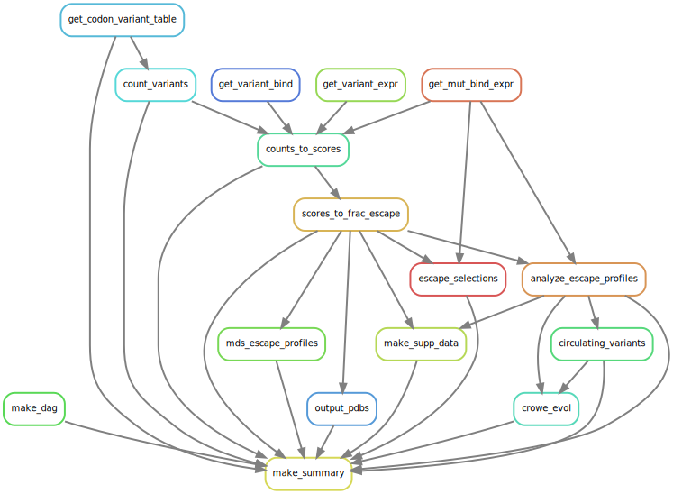

# Summary

Analysis run by [Snakefile](../../Snakefile)
using [this config file](../../config.yaml).
See the [README in the top directory](../../README.md)
for details.

Here is the DAG of the computational workflow:

Here is the Markdown output of each notebook in the workflow:

1. Get codon-variant-table from [here](https://media.githubusercontent.com/media/jbloomlab/SARS-CoV-2-RBD_DMS/master/results/variants/codon_variant_table.csv).

2. [Count variants](count_variants.md) to create a
   [variant counts file](../counts/variant_counts.csv).

3. [Escape scores from variant counts](counts_to_scores.md).

4. [Escape fractions for mutations and homologs](scores_to_frac_escape.md);
   creating [mutation escape fraction file](../escape_scores/escape_fracs.csv)
   and [homolog escape fraction file](../escape_scores/escape_fracs_homologs.csv).

5. Analyze and plot [escape profiles](analyze_escape_profiles.md).
   Also write file with [sites of strong escape](../escape_profiles/significant_escape_sites.csv).

6. [Multidimensional scaling](mds_escape_profiles.md) on escape profiles.

7. Map escape profiles to ``*.pdb`` files using [this notebook](output_pdbs.md)

8. [Create list of circulating variants from GISIAID sequences](circulating_variants.md).

9. Analyze escape profiles in light of evolutionary and functional constraint using [this notebook](evolution_escape_Crowe.md).

10. [Make supplementary data files](make_supp_data.md),
    which are [here](../supp_data).

11. [Analyze VSV escape selections](escape_selections.md).